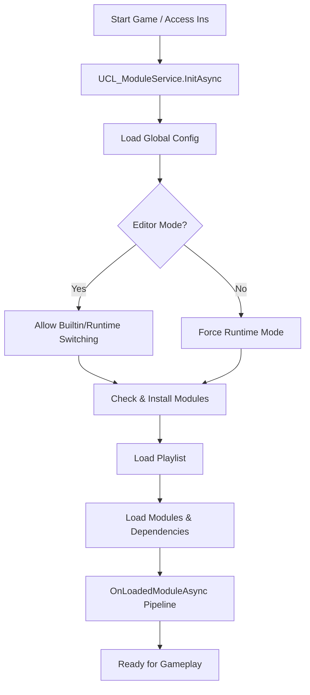

# UCL Module System Architecture

## Overview
The **UCL Module System** is a decentralized asset management framework designed to support modularity, runtime Modding, and cross-platform resource access. It decouples asset definitions from physical storage paths, allowing assets to be loaded from either built-in application folders or user-writable persistent storage.

## Core Components

### 1. UCL_ModuleService (The Brain)
- **Role**: Singleton manager for the entire module lifecycle.
- **Responsibilities**:
    - Initialization and loading of modules.
    - Managing the loading order (Playlist).
    - Handling asset path resolution and caching.
    - Providing hooks for external systems to react to module loading (`OnLoadedModuleAsync`).
    - Rendering the main Module Management GUI in the Inspector.

### 2. UCL_Module (The Container)
- **Role**: Represents a single module instance.
- **Responsibilities**:
    - Stores module metadata (ID, Title, Description, Version).
    - Manages its own `Config` (including dependencies).
    - Handles installation logic (copying from Builtin to Runtime).
    - Provides access to its local `AssetEntry` and `AssetMeta`.

### 3. UCL_ModulePath (The Navigator)
- **Role**: Static utility for all path-related calculations.
- **Architecture**: Uses `PersistantPath` to distinguish between:
    - **Builtin**: Source modules (read-only in builds).
    - **Runtime**: Working modules (read-write, supports Modding).
- **Key Flow**: Handles the "Installation" process where modules are synchronized or unzipped into the `PersistentDataPath`.

### 4. UCL_ModuleEntry (The Proxy)
- **Role**: A lightweight reference to a module.
- **Usage**: Used in dependency lists and dropdown popups to avoid loading entire `UCL_Module` objects until necessary.

---

## The Module Lifecycle Flow

## Path Resolution Strategy
The system uses a "Last Module Wins" strategy for asset resolution:
1. `UCL_ModuleService` maintains a list of `m_LoadedModules` based on the `Playlist`.
2. When searching for an asset (e.g., `GetAssetConfig`), it iterates through the loaded modules in **reverse order**.
3. The first module that contains the asset ID is selected, allowing newer modules to override assets from earlier modules.

## Installation & Sync
- **Builtin Modules**: Located in `Application.streamingAssetsPath` or a dedicated `.BuiltinModules` folder in Editor.
- **Runtime Modules**: Located in `Application.persistentDataPath`.
- **Zipping**: For distribution, modules can be zipped into the `StreamingAssets` folder. During the first run or update, the system unzips them into the `Runtime` path.

## Asset Grouping & Meta
Each module can have a `.CommonDataMeta` file for each asset type. This stores:
- **Grouping**: Organizing assets into logical folders (Groups).
- **Sorting**: Determining the order of assets within the GUI.
- **Custom Metadata**: Any extra info needed for specific asset types.
