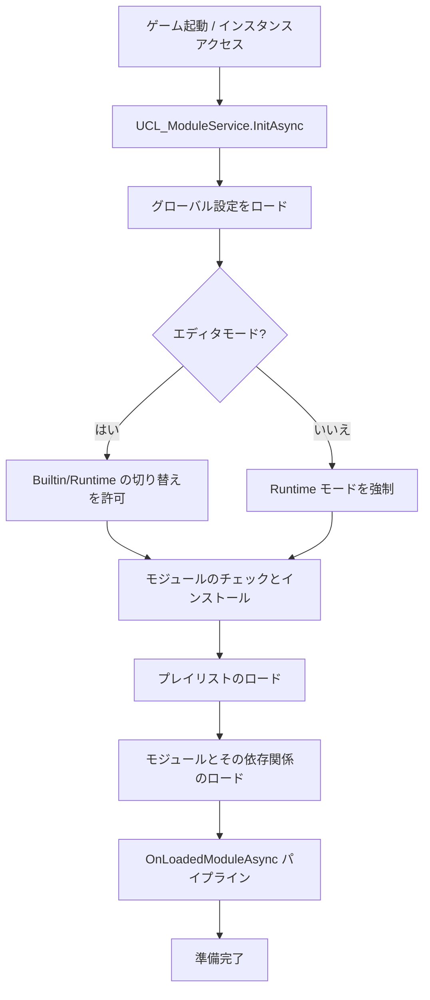

# UCL モジュールシステムアーキテクチャ (UCL Module System Architecture)

## 概要 (Overview)
**UCL モジュールシステム** は、分散型アセット管理フレームワークであり、モジュール性、実行時 Modding、およびクロスプラットフォームのリソースアクセスをサポートするように設計されています。アセットの定義を物理的な保存パスから切り離し、アプリケーションに組み込まれたフォルダまたはユーザーが書き込み可能な永続ストレージの両方からアセットをロードできるようにします。

## 核心コンポーネント (Core Components)

### 1. UCL_ModuleService (頭脳 - The Brain)
- **役割**: モジュールのライフサイクル全体を管理するシングルトンマネージャー。
- **職務**:
    - モジュールの初期化とロード。
    - ロード順序 (Playlist) の管理。
    - アセットパスの解決とキャッシュの処理。
    - 外部システムがモジュールのロードに反応するためのフックを提供 (`OnLoadedModuleAsync`)。
    - Inspector 内で主要なモジュール管理 GUI を描画。

### 2. UCL_Module (コンテナ - The Container)
- **役割**: 単一のモジュールインスタンスを表します。
- **職務**:
    - モジュールのメタデータ（ID、タイトル、説明、バージョン）を保持。
    - 自身の `Config`（依存関係を含む）を管理。
    - インストールロジック（Builtin から Runtime へのコピー）を処理。
    - ローカルの `AssetEntry` および `AssetMeta` へのアクセスを提供。

### 3. UCL_ModulePath (ナビゲーター - The Navigator)
- **役割**: すべてのパス関連の計算を行う静的ユーティリティクラス。
- **アーキテクチャ**: `PersistantPath` を使用して以下を区別します：
    - **Builtin**: ソースモジュール（ビルド内では読み取り専用）。
    - **Runtime**: 作業用モジュール（読み書き可能、Modding をサポート）。
- **主要フロー**: モジュールを `PersistentDataPath` に同期または展開する「インストール」プロセスを処理します。

### 4. UCL_ModuleEntry (プロキシ - The Proxy)
- **役割**: モジュールへの軽量なシリアライズ可能な参照。
- **用途**: 依存関係リストやドロップダウンポップアップで使用され、必要になるまで `UCL_Module` オブジェクト全体をロードするのを避けます。

---

## モジュールのライフサイクルフロー (The Module Lifecycle Flow)

## パス解決戦略 (Path Resolution Strategy)
システムは「後勝ち」 (Last Module Wins) のアセット解決戦略を採用しています：
1. `UCL_ModuleService` は `Playlist` に基づいて `m_LoadedModules` リストを維持します。
2. アセットを検索するとき（例：`GetAssetConfig`）、ロードされたモジュールを**逆順に走査**します。
3. そのアセット ID を含む最初のモジュールが選択され、新しいモジュールが以前のモジュールのアセットを上書きできるようになります。

## インストールと同期 (Installation & Sync)
- **Builtin モジュール**: `Application.streamingAssetsPath` またはエディタ内の `.BuiltinModules` フォルダに配置されます。
- **Runtime モジュール**: `Application.persistentDataPath` に配置されます。
- **圧縮 (Zipping)**: 配布用に、モジュールは `StreamingAssets` フォルダ内に `.zip` 形式で圧縮できます。初回実行時や更新時に、システムはそれらを `Runtime` パスに展開します。

## アセットのグループ化とメタデータ (Asset Grouping & Meta)
各モジュールは、アセットタイプごとに `.CommonDataMeta` ファイルを持つことができます。これには以下が格納されます：
- **グループ化 (Grouping)**: アセットを論理的なフォルダ（グループ）に整理します。
- **ソート (Sorting)**: GUI 内でのアセットの表示順序を決定します。
- **カスタムメタデータ**: 特定のアセットタイプに必要な追加情報。
