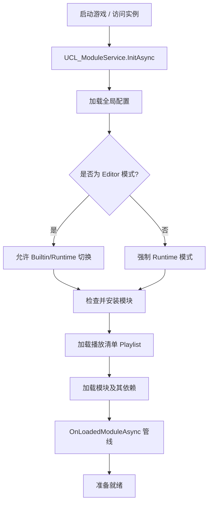

# UCL 模块系统架构 (UCL Module System Architecture)

## 概览 (Overview)
**UCL 模块系统** 是一个去中心化的资产管理框架，旨在支持模块化、运行时 Modding 以及跨平台资源访问。它将资产定义与物理存储路径解耦，允许资产从应用程序内置文件夹或用户可写入的持久化存储中加载。

## 核心组件 (Core Components)

### 1. UCL_ModuleService (主脑 - The Brain)
- **角色**：整个模块生命周期的单例管理器。
- **职责**：
    - 模块的初始化与加载。
    - 管理加载顺序 (Playlist)。
    - 处理资产路径解析与缓存。
    - 为外部系统提供钩子 (Hooks) 以响应模块加载 (`OnLoadedModuleAsync`)。
    - 在 Inspector 中渲染主要的模块管理 GUI。

### 2. UCL_Module (容器 - The Container)
- **角色**：代表单个模块实例。
- **职责**：
    - 存储模块元数据（ID、标题、描述、版本）。
    - 管理自身的 `Config`（包括依赖关系）。
    - 处理安装逻辑（从 Builtin 拷贝到 Runtime）。
    - 提供对其本地 `AssetEntry` 与 `AssetMeta` 的访问。

### 3. UCL_ModulePath (导航员 - The Navigator)
- **角色**：所有路径相关计算的静态工具类。
- **架构**：使用 `PersistantPath` 来区分：
    - **Builtin**：来源模块（在 Build 版本中只读）。
    - **Runtime**：工作模块（可读写，支持 Modding）。
- **关键流程**：处理“安装”过程，将模块同步或解压至 `PersistentDataPath`。

### 4. UCL_ModuleEntry (代理 - The Proxy)
- **角色**：对模块的轻量级引用。
- **用途**：用于依赖清单与下拉菜单中，避免在必要前加载整个 `UCL_Module` 对象。

---

## 模块生命周期流程 (The Module Lifecycle Flow)

## 路径解析策略 (Path Resolution Strategy)
系统采用“后加载者优先” (Last Module Wins) 的资产解析策略：
1. `UCL_ModuleService` 根据 `Playlist` 维护一个 `m_LoadedModules` 清单。
2. 当搜索资产时（例如 `GetAssetConfig`），会**反向遍历**已加载的模块。
3. 选择第一个包含该资产 ID 的模块，从而允许较新的模块覆盖早期模块的资产。

## 安装与同步 (Installation & Sync)
- **Builtin 模块**：位于 `Application.streamingAssetsPath` 或 Editor 中的 `.BuiltinModules` 文件夹。
- **Runtime 模块**：位于 `Application.persistentDataPath`。
- **压缩 (Zipping)**：为了发布，模块可以被压缩成 `.zip` 存放于 `StreamingAssets`。在首次运行或更新时，系统会将其解压至 `Runtime` 路径。

## 资产分组与元数据 (Asset Grouping & Meta)
每个模块可以为每种资产类型拥有一个 `.CommonDataMeta` 文件。这存储了：
- **分组 (Grouping)**：将资产组织到逻辑文件夹（Groups）。
- **排序 (Sorting)**：决定资产在 GUI 中的显示顺序。
- **自定义元数据**：特定资产类型所需的任何额外信息。
