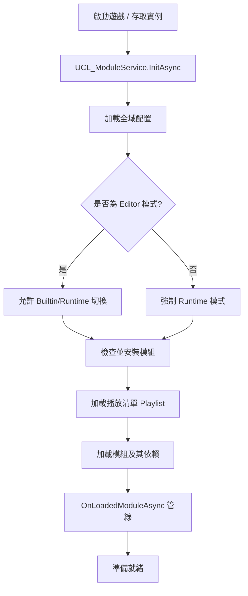

# UCL 模組系統架構 (UCL Module System Architecture)

## 概覽 (Overview)
**UCL 模組系統** 是一個去中心化的資產管理框架，旨在支援模組化、運行時 Modding 以及跨平台資源存取。它將資產定義與物理存儲路徑解耦，允許資產從應用程式內置資料夾或使用者可寫入的持久化存儲中加載。

## 核心組件 (Core Components)

### 1. UCL_ModuleService (主腦 - The Brain)
- **角色**：整個模組生命週期的單例管理器。
- **職責**：
    - 模組的初始化與加載。
    - 管理加載順序 (Playlist)。
    - 處理資產路徑解析與快取。
    - 為外部系統提供鉤子 (Hooks) 以響應模組加載 (`OnLoadedModuleAsync`)。
    - 在 Inspector 中渲染主要的模組管理 GUI。

### 2. UCL_Module (容器 - The Container)
- **角色**：代表單個模組實例。
- **職責**：
    - 儲存模組元數據（ID、標題、描述、版本）。
    - 管理自身的 `Config`（包括依賴關係）。
    - 處理安裝邏輯（從 Builtin 拷貝到 Runtime）。
    - 提供對其本地 `AssetEntry` 與 `AssetMeta` 的存取。

### 3. UCL_ModulePath (導航員 - The Navigator)
- **角色**：所有路徑相關計算的靜態工具類。
- **架構**：使用 `PersistantPath` 來區分：
    - **Builtin**：來源模組（在 Build 版本中唯讀）。
    - **Runtime**：工作模組（可讀寫，支援 Modding）。
- **關鍵流程**：處理「安裝」過程，將模組同步或解壓至 `PersistentDataPath`。

### 4. UCL_ModuleEntry (代理 - The Proxy)
- **角色**：對模組的輕量級引用。
- **用途**：用於依賴清單與下拉選單中，避免在必要前加載整個 `UCL_Module` 物件。

---

## 模組生命週期流程 (The Module Lifecycle Flow)

## 路徑解析策略 (Path Resolution Strategy)
系統採用「後加載者優先」 (Last Module Wins) 的資產解析策略：
1. `UCL_ModuleService` 根據 `Playlist` 維護一個 `m_LoadedModules` 清單。
2. 當搜尋資產時（例如 `GetAssetConfig`），會**反向遍歷**已加載的模組。
3. 選擇第一個包含該資產 ID 的模組，從而允許較新的模組覆蓋早期模組的資產。

## 安裝與同步 (Installation & Sync)
- **Builtin 模組**：位於 `Application.streamingAssetsPath` 或 Editor 中的 `.BuiltinModules` 資料夾。
- **Runtime 模組**：位於 `Application.persistentDataPath`。
- **壓縮 (Zipping)**：為了發佈，模組可以被壓縮成 `.zip` 存放於 `StreamingAssets`。在首次執行或更新時，系統會將其解壓至 `Runtime` 路徑。

## 資產分組與元數據 (Asset Grouping & Meta)
每個模組可以為每種資產類型擁有一個 `.CommonDataMeta` 檔案。這儲存了：
- **分組 (Grouping)**：將資產組織到邏輯資料夾（Groups）。
- **排序 (Sorting)**：決定資產在 GUI 中的顯示順序。
- **自定義元數據**：特定資產類型所需的任何額外資訊。
