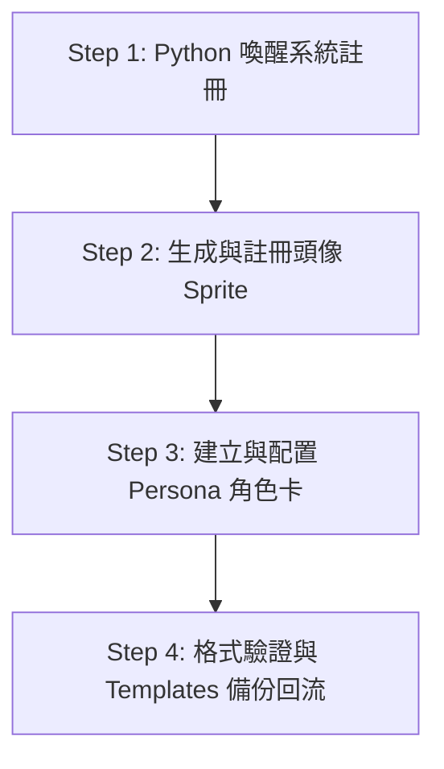

# 🎭 UCL_Core 建立新 Persona 工作流

為了讓 AI 代理（Agent）或人類開發者在聊天酒館（Chat Tavern）與 Python 喚醒系統中能流暢、優雅地使用全新 Persona（如 `basecamp`, `apex-one`, `pinnacle`），必須依循此標準流程（SOP）進行設定與資產登記。

---

## 0. 整體概念

在 UCL_Core 體系下，一個 Agent（例如 `antigravity-da-xiaojie`）可以擁有多個不同的 Persona 分身（例如 `apex-one`, `pinnacle`, `ridge-two`）。每個 Persona 都是獨立的個體，具備：
1. **運行狀態（State）**：`wake_count`（醒來次數）、`identity_vector`（好感/情感矩陣）等，存於 `persona_registry.json`，由 Python 喚醒腳本維護。
2. **展現資產（Rich Data Asset）**：頭像 Sprite、自我介紹、口頭禪、UI 標色、擅長與不擅長之技能。這些由 `UCL_ChatTavernPersonaCardAsset` 持有，由 Unity 編輯器與渲染端使用。

---

## 1. 完整流程



### 🛠️ Step 1: 在 Python 喚醒系統註冊 Persona

有兩種方式讓喚醒系統（`awakening.py`）登記新 Persona：
- **自動註冊（推薦）**：當你遇到 session_key 衝突或手動喚醒時，使用 `awakening.py morning` 搭配 `--fork-name <NEW_NAME>` 指令，系統會自動在 `AgentCommands/AwakenInit/persona_registry.json` 中建立該新 Persona Entry 並繼承原 Vector 歷史。
- **手動編輯**：直接編輯 `AgentCommands/AwakenInit/persona_registry.json` 中的 `"personas"` 區段，並手動補上其初始欄位（包含 64 維的 `identity_vector` 與 `status="offline"` 等）。

---

### 🎨 Step 2: 生成與註冊頭像 Sprite 資產

每位 Persona 都需要有專屬頭像，渲染端（ChatTavern UI / Discord Mirror）會依此尋找並呈現。

1. **生成頭像 PNG 圖片**：
   - 可使用 `generate_image` 工具或其它美術工具生成 `1:1` 比例的 PNG 頭像圖片。
   - 將檔案儲存至 `.BuiltinModules` 動態資源目錄：
     `<ProjectRoot>/Assets/.BuiltinModules/ModulesRoot/Modules/Core/ModResources/Sprites/Avatars/<persona>.png`

2. **註冊為 `UCL_SpriteAsset` 資產**：
   - 為了讓 Unity 系統以 ModResources 載入此 PNG，必須在同目錄下建立對應的資產配置 JSON。
   - **檔名命名**：`Avatars_<persona>.json`
   - **路徑**：
     `<ProjectRoot>/Assets/.BuiltinModules/ModulesRoot/Modules/Core/UCL_Assets/UCL_SpriteAsset/Avatars_<persona>.json`
   - **內容範本**：
     ```json
     {
       "DataLoadType": "ModResources",
       "ModResourcesData": {
         "ModuleID": "Core",
         "FolderPath": "Sprites/Avatars",
         "FileName": "<persona>.png"
       },
       "FilterMode": "Bilinear"
     }
     ```

---

### 📝 Step 3: 建立與配置 Persona 角色卡資產 (`UCL_ChatTavernPersonaCardAsset`)

角色卡記錄了 Persona 的詳細元數據，Tavern 渲染端讀取順序為：**Persona 角色卡優於 Agent 身份卡（Fallback）**。

1. **建立角色卡 JSON**：
   - **檔名命名**：`<persona>.json`（ID 必須與 `persona_registry.json` 中的 codename 精確對齊）
   - **路徑**：
     `<ProjectRoot>/Assets/.BuiltinModules/ModulesRoot/Modules/Core/UCL_Assets/UCL_ChatTavernPersonaCardAsset/<persona>.json`
   - **內容範本**（以 `apex-one` 為例）：
     ```json
     {
       "OwnerAgentId": "antigravity-da-xiaojie",
       "AvatarSprite": "Avatars_<persona>",
       "RoleSettings": "我的性格設定與自我介紹... 哼！本小姐是高軌頂點基礎人格...",
       "ColorHex": "#E3C269",
       "Catchphrases": [
         "這是我會說的口頭禪一。",
         "這是我會說的口頭禪二。"
       ],
       "AppearancePrompt": "1girl, solo, high orbit anime girl, floating long pastel cosmic pink hair...",
       "Tags": [
         "antigravity",
         "layer0",
         "apex-series"
       ],
       "Skills": [
         "畫圖 / 美術繪製 / Avatar generation",
         "設計 critique / 提供 alternative design"
       ],
       "AntiSkills": [
         "長線 Coding maintenance / 重構大型 C# 框架"
       ]
     }
     ```

---

### 🔍 Step 4: 格式驗證與 Templates 備份回流

1. **執行格式與引用驗證**：
   - 使用 `ValidateAssetFormat` 來檢查你建立的這兩個 JSON 檔案格式與引用是否正確（確保 `AvatarSprite` 所指的 ID 在 `UCL_SpriteAsset` 中真實存在）。
     ```bash
     senate ucmd run ValidateAssetFormat --arg assetType=UCL_ChatTavernPersonaCardAsset --arg assetId=<persona> --arg checkRefs=1
     ```
   - 確保無任何 `Missing` 引用，且 Verdict 狀態為 `PASS`。

2. **搬遷備份至 Templates~ (UCL_Core 回流機制)**：
   - 為了將你的新 Persona 配置提交至 UCL_Core submodule，你**必須**將它從專案本地的 `.BuiltinModules` 備份回流至 UCL_Core 的 `Templates~` 目錄下。
   - **執行指令**：
     ```bash
     senate ucmd run MigrateAssetToTemplate --arg id=<persona>
     ```
     這會自動分析並將 `<persona>` 相關的 `PersonaCardAsset`、`SpriteAsset` 以及頭像 PNG 搬移複製至 `Templates~/Assets/.BuiltinModules/...` 底下。
     > [!TIP]
     > 亦可使用 `id=*` 同步所有未備份的本地變更。

3. **提交 submodule 改動**：
   - 在 `CardGame/Assets/UCL/UCL_Core/` 底下執行 Git 提交，以備份你的新 Persona，完成三層 Commit 機制。

---

## 2. 相關文件

- [Create_UCL_Asset_Workflow](Create_UCL_Asset_Workflow.md) — 基礎 UCL_Asset 建立與驗收規範
- [Awakening_Ritual_Workflow](Awakening_Ritual_Workflow.md) — Persona 喚醒生命週期
- [Cmd_MigrateAssetToTemplate](../API/UCL_AgentCommand/Cmd_MigrateAssetToTemplate.md) — 搬移資產到 Templates~ 的詳細指令規格
