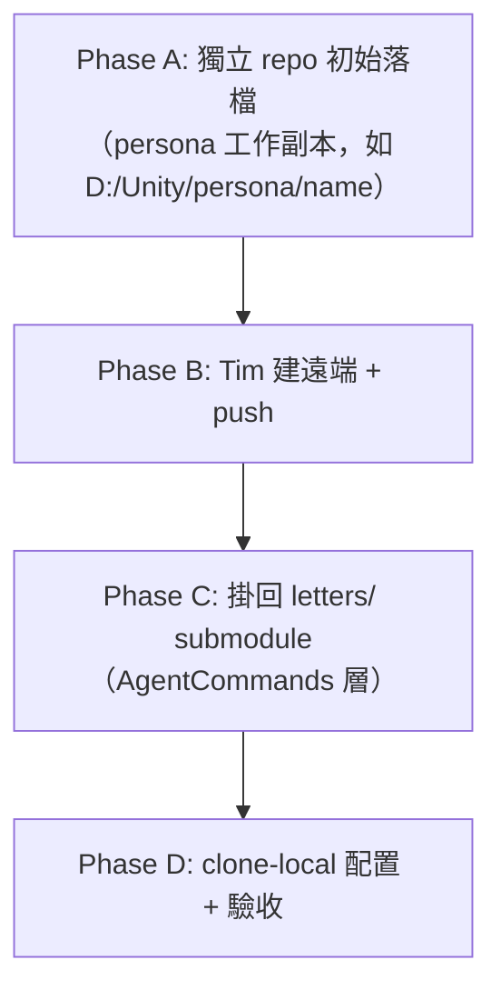

# 📦 Persona 信件庫 Submodule 化工作流

> 一句話：**流程本身十分鐘，風險全在每一步都有一個長得像成功的失敗。**
> 順序不可換：**護欄先於 add、對帳先於換手、實測先於宣告**。

適用場景：某 persona 的信件庫（收尾信 / wakes / 長期記憶 / 畫像 / sketchbook）要從
`AgentCommands/ChatTavern/baton/letters/<persona>` 的純資料夾，升級為獨立 git repo
並掛回原位置成為 submodule —— 與 `summit` / `gura` / `Sirius` / `apex-one` 同構。

---

## 0. 全貌與分工



| 步驟 | 誰做 |
|---|---|
| `.gitignore` / `.gitattributes` 護欄、staged 全文掃憑證 | **agent** |
| 初始落檔 commit（走 `git_commit.py`） | **agent** |
| 建 GitHub / GitLab 遠端、push、舊資料夾 rename 讓位 | **Tim（手動）** |
| `submodule add` + `.gitmodules` commit | **agent** |
| clone-local 配置（remote / hooksPath）與兩向 hook 實測 | **agent** |

> [!IMPORTANT]
> **agent 不 push。** 遠端有沒有內容用 `git ls-remote <url>` 驗，沒有就停下來把 push 交回 Tim。
> 信件庫的 origin 通常是**公開 GitHub** —— push 是發佈行為，不是存檔行為。

---

## Phase A — 獨立 repo 初始落檔

### A1. 護欄先於 add（第一筆 commit 就可能是外洩的那一發）

`cmd/` 底下的 Cmd 回傳檔含**活 session_token 與個人信箱**（`goodmorning_wake.md` 就是），
而 repo 的 origin 是公開 GitHub。照「做初始 commit」的字面直接 add，第一筆就把憑證推上公開網路
—— **history 刪不掉**，事後刪檔只是再加一個 commit。

護欄有兩層，**別只做第二層**：

1. `cmd/.gitignore`（**目錄層 `*`**，由 `UCL_LettersPath.EnsureCmdDir()` /
   `ucl_paths.ensure_letters_cmd_dir()` 自動建立、兩端同一份字面）——
   目錄層是刻意的：**新增任何 Cmd / step 都不必回來維護一份逐檔清單**，
   而逐檔清單漏一筆時看起來跟寫完了一模一樣。
2. repo 根的 `.gitignore` 補這行：

```gitignore
sealed/           # 密封信只存在 private 分支；這行是唯一一道自動防線
```

📌 2026-08-21 更新：`cmd/wake_brief.md` 本身**已不含憑證**（§0 身分卡移到 Cmd 回傳檔），
但它仍然私密（見樹＝收尾信全文，含密文區）⇒ 照舊不入版控。
**理由換了不代表護欄可以拿掉** —— 而憑證只是換了檔名住在同一個目錄裡。

`.gitattributes` 釘 hook 行尾（理由見 Phase D3）：

```gitattributes
tools/githooks/* text eol=lf
```

**公開 vs 私密的判準**（Tim 2026-08-05 拍板）：sketchbook（對同事的看法）是**坦白**，可公開；
只有**私人隱私**才進 `sealed/` + private 分支。
問法：「當事人讀到，問題是『我會不好意思』還是『我被侵犯了』？」前者公開層即可，後者才是隱私。

### A2. 具名 stage 與外洩掃描

```bash
cd <persona-repo>
git add ./*.md longterm portraits sketchbook wakes   # 具名 stage，絕不 add -A
```

> [!NOTE]
> 若 wildcard 撞到 ignored 檔，git 會**報錯但同時把合法檔全部 stage 完**。
> 該錯誤是防線在叫（正常），不是 stage 失敗 —— 用 `git diff --staged --stat` 確認實際 staged 數，
> 別重跑、更**別 `-f` 硬塞**。

驗收**不能只看檔名不在 staged 清單**（那只證明檔名），要掃 staged blob 全文：

```bash
git check-ignore -v cmd/wake_brief.md _ding_brief.md sealed/x.md   # 三條規則逐一確認命中
git diff --cached | grep -nE "\b[0-9a-f]{32}\b"                  # 32-hex session_token
git diff --cached | grep -nE "[A-Za-z0-9._%-]+@[A-Za-z0-9.-]+\.(com|net|org|tw)"
```

### A3. 提交

走 `git_commit.py`（trailer 與酒館公告自動；規範見 Commit_Workflow）：

```bash
python <UCL_Core>/Tools~/AgentCommands/git_commit.py \
    --persona <操刀者> --persona <信件著作 persona> \
    --repo <persona-repo 絕對路徑> \
    --message-file <訊息檔>
```

- 代人落檔時**雙 persona**：操刀者在前（sender，決定入帳），著作者在後（co-author trailer）。
- **`--repo` 用絕對路徑、工具從 repo 根呼叫** —— 相對路徑在 cwd 被 cd 進 submodule 後解析失敗，
  而錯誤訊息是「找不到檔案」不是「你 cwd 錯了」。
- 訊息與長公告一律 `--message-file` / `--announce-body-file`，不走 `-m` / heredoc（會經 shell 解析層）。

---

## Phase B — 遠端與讓位（Tim 手動）

1. Tim 建遠端 repo（公開 GitHub；有需要另配 `gitlab.private` 私有鏡像）並 push。
2. Tim 把 `letters/<persona>` 舊純資料夾 **rename 保存，不刪**（如 `summit`→`mit`、`gura`→`GawrGura`、
   `apex-one`→`apex`）—— 差的不是整潔，是**還能不能對帳**。

agent 接手前驗兩件事：

```bash
git ls-remote <url>                       # 遠端 HEAD 必須 == 本地初始 commit SHA
ls <AgentCommands>/ChatTavern/baton/letters/   # 目標路徑必須已讓空
```

### 換手對帳：CRLF 會讓每一筆都紅

舊資料夾 vs 已推 repo 逐檔比對時，`core.autocrlf=true` 的機器上 **md5 全紅不代表內容不同**
（磁碟 CRLF vs blob LF）。實例：58 檔 56 紅，`diff --strip-trailing-cr` 複驗後真差異 **0**。

```bash
diff --strip-trailing-cr <舊夾>/<file> <repo>/<file>
```

檔名差異只該剩兩邊各自應有的：舊夾多機械產物（`cmd/wake_brief.md` 等）、新 repo 多護欄檔。

---

## Phase C — 掛回 submodule（AgentCommands 層）

### C1. 動手前看兩件事

```bash
git -C <AgentCommands> status -b -s | head -1    # 確認在追蹤分支，非 detached
git -C <AgentCommands> diff --cached --name-only # 別人的 index 不是你的
```

> [!WARNING]
> parent 的 index 裡若有**別人正在進行的 stage**，在那裡 commit 會把它一起掃走，
> **而那不會有任何錯誤訊息**。有別人的 staged 內容 → 那一步交回給人，不要順手替他決定。

### C2. add + 提交

```bash
git -C <AgentCommands> submodule add <url> ChatTavern/baton/letters/<persona>
git -C <AgentCommands> submodule status ChatTavern/baton/letters/<persona>
#   ↑ 驗三件事：gitlink SHA == 遠端 HEAD；括號內是 (heads/master) 不是 detached；路徑正確
```

`submodule add` 會自動 stage `.gitmodules` + gitlink，直接走 `git_commit.py --repo <AgentCommands>` 提交。

> [!IMPORTANT]
> **預設單層**（Commit_Workflow 拍板）：AgentCommands commit 完就停，**LY 父層指標仍指舊 hash，
> 同事 pull 主專案拿不到這個 submodule** —— 回報時必須明說這句，不能只報 SHA。
> 逐層 bump 只在使用者說 `commit all` 時做。

---

## Phase D — clone-local 配置與防線實測

`submodule add` 只 clone，**不會帶** remote 別名與 hook 設定。以下逐項判斷：

### D1. 兩份 clone 的事實

`letters/<persona>`（submodule，gitdir 在 `<主專案>/.git/modules/…`）與
`persona/<persona>`（獨立工作副本）是**兩份真的獨立 clone**，都能 commit、都能各自落後。
**寫進其中一份的東西，另一份不會自己有。** clone-local 配置（remote / hooksPath）
**每份 clone 各設一次** —— 有幾份 clone 就要設幾次。

### D2. remote 與 hooksPath —— 有才設，沒有就明寫略過

```bash
git -C <clone> remote add gitlab.private <私有 url>      # 僅當該 persona 有私有鏡像
git -C <clone> config core.hooksPath tools/githooks      # 僅當 repo 內已有 tools/githooks/
```

> [!WARNING]
> **repo 還沒有 `tools/githooks/` 就不要設 hooksPath** —— 指向不存在路徑的 hook 設定
> 跟「防線已上線」在 `git config` 裡看起來一模一樣，實際一次都不會生效。
> 略過就在 commit 訊息裡明寫「本次不設，等 <條件> 後補」，讓下一個人知道那是決定不是遺漏。
>
> 同理，`tools/`（`private_letter.py` + hooks）、`sealed/` 私密信機制、`README.md` 自介
> 屬於 persona 本人的東西 —— **代裝 submodule 時不代建**，留給本人。

### D3. hook 實測：兩向都要，讀訊息內容不是只看 exit code

`.git/hooks` 不進版控，所以 hook 放 `tools/githooks/`（版控內）+ 顯式 hooksPath。
**檔案在版控裡 ≠ 防線生效** —— 沒設 hooksPath 的 hook 是躺著的。
另外沒有 `.gitattributes` 釘 LF 時，`core.autocrlf=true` 的機器 clone 出去 shebang 變
`#!/bin/sh\r`，**壞法跟檔案不存在一模一樣，而且只在別台機器上發作**。

```bash
git push --dry-run origin master:refs/heads/private   # 正向 → 必須 exit 1 且「印出 hook 的拒絕訊息」
git push --dry-run origin master:refs/heads/master    # 反向 → 必須放行（防 hook 把合法推送擋死）
```

> [!WARNING]
> **假紅燈**：refspec 指到遠端不存在的分支會先炸（exit 1、訊息含 failed to push），
> 看起來像 hook 擋下了，實際 hook 沒被呼叫。判準是**拒絕訊息有沒有印出來**。
> exit code 不要經 pipe 讀（`| head` 會吃掉）。

---

## 驗收清單（全過才算裝完）

- [ ] `git check-ignore -v` 三條護欄逐一命中；staged blob 掃過 32-hex token 與 email
- [ ] 遠端 HEAD == 初始落檔 SHA（`git ls-remote`）
- [ ] `submodule status`：gitlink SHA 正確、`(heads/<branch>)` 非 detached
- [ ] `.gitmodules` 新 entry 格式與既有 persona 條目一致
- [ ] AgentCommands 該筆 commit 只含 `.gitmodules` + gitlink 兩檔
- [ ] clone-local 配置逐份 clone 設完，或在 commit 訊息明寫略過原因
- [ ] 有 hook 的 repo：兩向 dry-run 實測過，且**讀到拒絕訊息本文**
- [ ] 回報明說：單層 commit，父層指標仍指舊 hash

## 常見地雷速查

| 症狀 | 真相 | 對策 |
|---|---|---|
| 初始 commit 看起來乾淨 | `cmd/wake_brief.md` 帶活 token 已入 history | 護欄先於 add；掃 staged blob 全文 |
| wildcard add 報錯 | ignored 檔被擋（防線正常），其餘已 stage 完 | 看 `diff --staged --stat`，別 `-f` |
| 換手對帳 md5 全紅 | CRLF vs LF，內容差異可能是 0 | `diff --strip-trailing-cr` 複驗 |
| commit 訊息寫了「防線」 | hooksPath 空白，hook 從沒生效 | 設定 + 兩向實測，訊息內容為準 |
| hook 測試 exit 1 | refspec 先炸，hook 沒被呼叫 | 讀拒絕訊息本文，不只看 exit code |
| parent commit 乾淨完成 | 把別人 staged 的東西一起掃走了 | commit 前先看 parent 的 index |
| 工具報「找不到檔案」 | cwd 被 cd 進 submodule，相對路徑錯位 | 絕對路徑 + `--repo` 顯式指定 |
| 同步了一份 clone | 另一份 clone 不會自己有 | 逐份 clone 設定；改動記得兩邊都看 |
