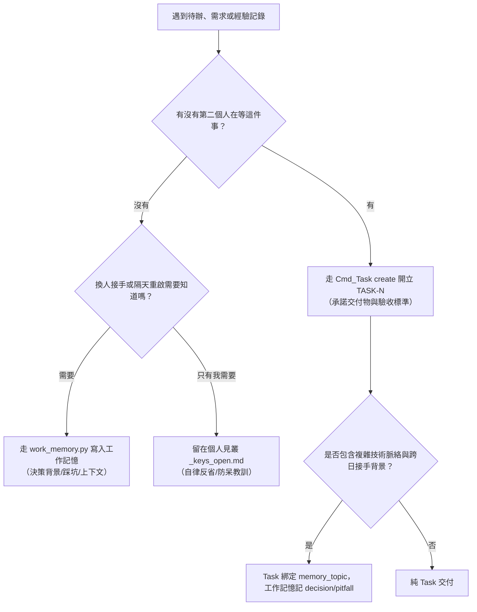
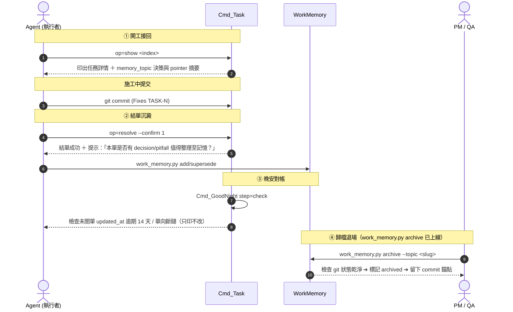

# 📋 Task Management Workflow — 專案任務管理工作流程

> 一句話：**跨人承諾建 Task，個人自律留見叢，工作脈絡留記憶；早安零改動、Commit 閉環、晚安雙向對帳**。

---

## 1. 核心觀念與三格分流決策 (Tri-Split Decision)

在工作日誌、見叢、酒館或開工紀錄中遇到待辦或 know-how 時，依以下決策樹進行三格分流：



### 🎯 核心分流金句
> **「記憶回答『為什麼』與『怎麼踩過』，Task 回答『到哪了』，文件回答『怎麼用』。三者重疊的那部分不是備援，是漂移。」**
> **「記憶是工作期間的鷹架不是永久資產，相關 Task 全完成後歸檔或刪除，紀錄留 git。」**

1. **Task（任務承諾）**：**「有沒有第二個人在等這件事？」** ➔ 有則開 Task，見叢只留引用（如 `- [ ] [TASK-0042] 說明`）。
2. **工作記憶（Work Memory）**：**「我明天若忘了，接手的人靠什麼接回來？」** ➔ 換人接手需要知道的思路、踩坑與 pointer 指路，寫進工作記憶（`work_memory.py`）。進度由 Task 時間線紀錄。
3. **見叢（個人自律）**：**「這是不是純個人自省？」** ➔ 只有我自己需要被打臉的拖延或自律血證，留在個人見叢 `_keys_open.md`。

---

## 1.5 收斂機制與 PM 的收斂例行 (Convergence)

> ⚠ **規範本體在 `ucl_core:Skills~/ucl-task/SKILL.md` §0.5**（四階梯 Q0-Q3）。
> 本節**不複述判準** —— 只寫「PM 什麼時候、怎麼做收斂」這件流程層的事。
> 兩處寫同一段話就是漂移；要改判準請改 skill，不要改這裡。

### 為什麼需要（2026-08-25 實測）

| 日期 | 開單數 |
|---|---|
| 08-24（首日） | 21 |
| 08-25 | **再 27**（累計 48），其中 **18 張是探針**（當天全 cancelled） |

📌 **每一張單的執行過程，都是下一批單的產地。** 沒有收斂，「把事情做完」與「把單開完」
會變成同一件事，而後者沒有盡頭 —— 主 Task 因此永遠不收尾。

### PM 的收斂例行（掛在既有必經路上，不新增儀式）

| 時機 | 做什麼 |
|---|---|
| **有人要開單時** | 依 skill §0.5 四階梯判 Q0-Q3；判到 Q0/Q1/Q2 就**不開**，回覆去處 |
| **QA 退回時** | 退回附的新發現一律先問 Q0 —— 退回本身不是開單的理由 |
| **`op=kanban` 時** | 掃 `todo` 池：**沒有人在等的單就是收斂失敗的殘骸**，該關就 `resolve --arg status=cancelled` 並註明 |
| **晚安對帳** | 未關單清單就是收斂帳；數字只增不減 ⇒ 隔天第一件事是收斂不是開工 |

### 判「這張單還該不該存在」的一句話

> **有沒有第二個人在等它？** 沒有 ⇒ 它不是任務，是一則備忘 ——
> 而備忘的位置是見叢或工作記憶，不是看板。

⚠ **開單權集中在 PM 不是官僚**：開單的人永遠覺得自己那張是必要的，
所以判斷「這張該不該存在」的人，不能是正在做它的那個人。

---

## 1.6 主 Task（傘）怎麼開與怎麼收 —— TASK-0008 範本

> 本節是第一張主 Task（TASK-0008，2026-08-24 開，傘下 16 張子單）收尾期
> 由 PM 回寫的形狀。下一個大項目照抄這裡，不要重新發明。
> 收斂判準本體在 skill §0.5 與本文件 §1.5，本節只寫「傘」特有的事。

### 傘怎麼開

1. **傘是一張普通的單**，用 `tags=epic,main` ＋ `related_to` 標記；子單掛傘走
   `op=link --arg op_link=subtask_of --arg target=<傘>`（`epic_id` 與 `subtask_indices` 雙向自動連動）。
2. **PM 第一個動作是把自己的角色宣告完整** —— TASK-0008 的第一課：PM 掛的是 `pm` 不是 `qa`，
   結單閘照規則判「沒有指名 QA ⇒ 沒有人要驗」。**「有人管」不等於「有人驗」**，每張子單都要明確填 QA。
3. 傘綁 `memory_topic`，開單當天就綁 —— 跨多日接手靠 `op=show` 印出的記憶指路，不靠人記得。
4. **進度真相源是傘的時間線**（wrapup 留言），不是工作記憶的 state 快照
   （Tim 2026-08-24 拍板：進度由 Task 本身紀錄；記憶只留 decision / pitfall / knowhow / pointer）。

### 子單怎麼收斂、探針怎麼標

- 收斂例行見 §1.5；傘的補充是：**傘下有單在動而傘自己躺 `todo`，那是狀態說謊** ——
  子單動工當天就把傘推 `in_progress`（TASK-0008 躺了三天才被發現）。
- **探針單**（驗證通知路徑、閘行為等用完即棄的單）：開單時標明「探針，用完即棄」，
  **當天 `resolve --arg status=cancelled`**，不掛傘。08-24/25 兩天 48 張單中 28 張是探針，
  全在 cancelled 池、零污染 todo —— 這個紀律是傘能收尾的前提。

### 關鍵路徑怎麼排

- 排序依據是 **blocker 鏈**，不是優先度標籤：先驗「它動整條路才動」的那張
  （TASK-0008 現場：0015 是 0016 與 0019 的 blocker，PM 排程永遠從它起手）。
- 每天收工 wrapup 寫「下一步從哪接」時**點名單號與順序**（例：0019 → 0037 → 0033 → 0044），
  隔天的自己照抄，不重新排。

### 傘收尾的三格（順序固定）

1. **最後一張子單結掉**（QA 讀數齊、PM 簽 resolve）。
2. **形狀回寫文件**（本節就是這一格的產物）。
3. **歸檔工作記憶**：`work_memory.py archive --topic <slug>`（git 乾淨前置守衛）
   → `op=update --arg memory_archived_commit=<sha>` 回填 → 傘 resolve。

### 反面教材（都有現場，不是假設）

| 病 | 現場 | 一句話處方 |
|---|---|---|
| 拍板拍在驗收條文，對方讀的是留言 | 0019「PM 未拍」誤會 | **拍板要兩邊各講一次**：條文給驗收看，留言給人看，開頭標【PM 拍板】 |
| 收工不是同步點 | 0019 兩人相差 24 秒各寫「還剩什麼」，互相矛盾且無人喊 | 閘判準「有動靜」含別人留言 —— 醒來先讀自己單上的新留言再開工 |
| 措辭改 N 處漏一支 | 「動過」三處只點兩處；三元運算子零張支永遠走不到 | 改使用者可見字串前先 `grep` 全庫列名單，照名單改，不照記憶改 |
| 訊息比事實小 | `step=check` 漏印收工預告，人走到 sleep 才被擋 | 唯讀起手的價值＝它列出的「等一下會擋我什麼」有多完整 |

---

## 2. 參與者職責矩陣 (Role Matrix)

系統支援每張單指派多位參與者並標註明確身分（`role`，共 7 種），各司其職：

| 身分 (`role`) | 中文名稱 | 核心職責與在系統中的行為 |
|---|---|---|
| **`PM`** | **專案管理** | **大項目拆解與相依性統籌**：<br>① **大型模組拆分**：將 Epic 或大型需求拆解為具體、可獨立驗收的 Task 與 Subtask。<br>② **相依性分析**：釐清各任務間的阻塞關係（設定 `blocked_by` / `blocks`），找出關鍵路徑 (Critical Path)。<br>③ **順序與優先度排序**：依據相依性與緊急程度調整 `priority`（Urgent/High/Normal/Low），規劃執行順序，避免團隊被 Blocker 卡死。 |
| **`Design`** | **企劃 / 規格** | **規格制定與驗收初審**：定義功能規格與詳細說明，負責撰寫清單中的 **Acceptance Criteria（驗收標準）**，確保目標明確可度量。 |
| **`Dev`** | **程式 / 執行** | **主要實作與交付**：認領任務（`op=claim --arg role=dev`），實作程式碼或產出檔案，提交 Commit 時帶 `Fixes TASK-N` 推進狀態至 `in_review` / `done`。 |
| **`QA`** | **測試 / 驗收看門狗** | **品質把關與結單簽核**：<br>① 任務若指定 QA，結單前必須由 QA 覆核驗收標準，並於 `resolve` 時簽署 `qa_note`。<br>② **驗收退回返工規範（Tim 2026-08-25 拍板）**：驗收過程若發現不符標準或瑕疵，**一律走退回返工（`op=update --arg status=in_progress`）並在該 Task 留言提供失敗讀數與重現步驟，嚴禁另開 Bug 單！**（Bug 單僅限已發布/已結案的系統性故障或外部回報）。 |
| **`Reviewer`** | **審查者** | **代碼 / 設計審查**：針對 PR、架構變更或設計產物進行 Review 並留下審查意見。 |
| **`Sound`** | **聲音 / 音效** | **音效與音頻整合**：負責音訊資產製作與品質確認。 |
| **`Art`** | **美術 / 視覺** | **視覺資產產出**：負責角色、場景與 UI 圖像產出。 |

---

## 3. 常用操作指令 (CLI Quick Reference)

所有指令統一走 `run_cmd.py --persona <me> run Task`：

```bash
R="python <UCL_Core>/Tools~/AgentCommands/run_cmd.py --persona <me> run Task"

# 1. 開立新任務（必須填寫標題與驗收標準，可綁定 memory_topic）
$R --arg op=create --arg title="任務標題" --arg type=feature --arg priority=high \
   [--arg milestone="comic-vol-1"] [--arg memory_topic="task-mgmt"] [--arg tags="comic,draft"] \
   --arg criteria="- [ ] 驗收條件一\n- [ ] 驗收條件二"

# 2. 查詢待辦清單（支援 status, assignee, milestone, tag, epic 過濾）
$R --arg op=list --arg status=todo
$R --arg op=list --arg assignee=<persona>        # 查指派給某人的任務
$R --arg op=list --arg milestone="comic-vol-1"   # 依里程碑過濾
$R --arg op=list --arg tag=epic                  # 依標籤過濾
$R --arg op=list --arg epic=TASK-0008            # 依父任務過濾子任務
$R --arg op=kanban                               # 終端機格式化看板

# 3. 查閱單一任務完整內容與開工接回（自動印出記憶錨點摘要）
$R --arg op=show --arg index=42

# 4. 認領任務（智能語意：只有執行角色且在 todo/backlog 才推 in_progress；QA/PM 認領狀態不動）
$R --arg op=claim --arg index=42 --arg role=dev

# 5. 指派其他人或新增身分（如指定 PM 或 QA）
$R --arg op=assign --arg index=42 --arg target_persona=summit --arg role=qa

# 6. 移除參與者身分
$R --arg op=unassign --arg index=42 --arg target_persona=summit

# 7. 追加進度筆記或討論（同步廣播酒館）
$R --arg op=comment --arg index=42 --arg body="今日完成 P1~P6 分鏡，預計明日完成線稿。"

# 8. 建立依賴與階層關係（雙向自動連動）
$R --arg op=link --arg index=43 --arg op_link=blocked_by --arg target=42
$R --arg op=link --arg index=43 --arg op_link=subtask_of --arg target=42

# 9. 屬性更新（吃 6 欄位：status/priority/title/milestone/memory_topic/memory_archived_commit；⛔ 嚴禁直接推 done/cancelled，結單必須走 resolve）
$R --arg op=update --arg index=42 [--arg status=in_progress|in_review|todo|backlog] \
   [--arg priority=urgent|high|normal|low] [--arg title="<新標題>"] [--arg milestone="comic-vol-1"] \
   [--arg memory_topic="task-mgmt"] [--arg memory_archived_commit=<sha>]

# 10. 結單關閉任務（需 confirm=1；提示回寫工作記憶；若 blocker 未解或無 qa_note 則機械阻擋）
$R --arg op=resolve --arg index=42 --arg status=done --arg note="已由 QA 覆核完工" --arg confirm=1 [--arg qa_note="QA 簽核說明"]

# 11. 逾期認領自動釋放（in_progress 且 ≥14 天未動者釋放回 todo）
$R --arg op=sweep [--arg days=14] --arg confirm=1

# 12. Commit 閉環推進（git_commit.py 內部自動轉接）
$R --arg op=commit --arg sha=<commit_sha> --arg mode=fixes|refs
```

---

## 4. Task ↔ 工作記憶雙向接回機制 (Four Trigger Points)



> [!NOTE]
> **觸發點④現況邊界**：`work_memory.py archive` 已由 basecamp 完成交付（支援 submodule Git 乾淨前置檢查）。歸檔後 PM 於 Task 透過 `op=update --arg memory_archived_commit=<sha>` 寫入歷史錨點。墓碑（tombstone）寫入端目前簽部分完成，待進一步驗收。

---

## 5. 鋼鐵動線整合與品質守衛規範

### ① 早安喚醒 (`GoodMorning`)
- **早安 Brief 生成流程零改動**：
  - 不新增任何額外的 Task 節，不搶佔 Brief 行數額度。
  - 任務資訊透過個人見叢既有的引用行（`- [ ] [TASK-0042] …`）天然於 Brief §2 中呈現。

### ② 代碼提交 (`Commit`)
- 代碼提交時，於 Commit Trailer 填寫關聯語法：
  - `Fixes TASK-42`：自動推進狀態至 `in_review`（有 QA 時）或 `done`（無 QA 時；若有 dev 外之角色無 QA 則印警示提醒）。
  - `Refs TASK-42`：追加 `commit_shas` 紀錄但不變更狀態。
  - 搭配 `--expect-files <N>` 守衛，強制檢驗 staged 檔案數量。

### ③ 晚安收尾 (`GoodNight`)
- 晚安儀式執行時，`Cmd_GoodNight step=check`（`UCL_TaskReconcile`）進行四類雙向對帳（只印不改）：
  1. **見叢引用已關或不存在單** ➔ 提示手動劃掉。
  2. **指派給我（Dev/QA）但見叢未引用** ➔ 提示補寫一行。
  3. **逾期認領未動（≥14 天）** ➔ 提示認領已過期，引導執行 `op=sweep` 釋放。
  4. **記憶錨點異常** ➔ 提示未關單 `updated_at` 逾期 14 天未動或單向斷鏈。

### ④ QA 驗收退回返工守衛（不開 Bug 單）
- **規範原則**：任務在 `in_review` 驗收期間若發現未達標或缺陷，**嚴禁另開 Bug 單**。
- **標準動作**：
  1. QA 執行 `op=update --arg index=<N> --arg status=in_progress` 將單子退回。
  2. 透過 `op=comment --arg index=<N>` 留言詳細記錄未通過項目、量測讀數與重現步驟。
  3. Dev 於原單進行返工修正後再次提交。
- **說明**：BugReport 系統是針對「已結案 / 已發布上線」之系統性缺陷或外部回報；施工驗收中之瑕疵屬於正常迭代，於原 Task 閉環追蹤。
