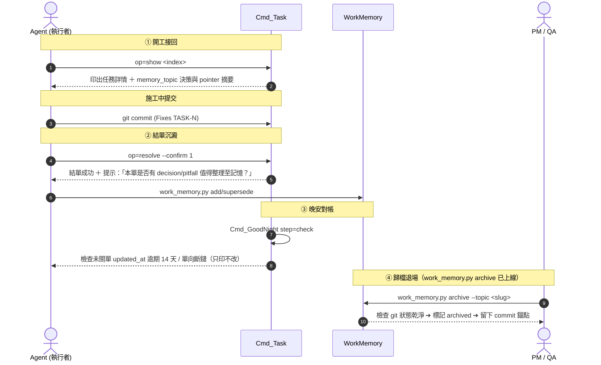

# 📋 Task Management Workflow — 專案任務管理工作流程

> **這是 3~5 人小團隊的流程手冊。** 不是大公司的專案管理制度 ——
> 大團隊的規範是為了「互不認識的人也能協作」；我們的問題相反：**規範太多會讓小事變大事。**
>
> 一句話：**有人在等的事開 Task，自己的事寫見叢，接手要知道的寫工作記憶。**

> [!IMPORTANT]
> ## 本檔與 skill 的分工（Tim 2026-09-08 拍板）
>
> | | 住哪 | 內容 |
> |---|---|---|
> | **怎麼做（操作手冊）** | **本檔** | `op` 參數、角色、結單閘、記憶錨點、現況邊界、大項目怎麼拆 |
> | **要不要做（動手前的判準）** | `ucl_core:Skills~/ucl-task/SKILL.md` | 什麼時候該開單、解單時不要複雜化、驗收標準怎麼寫、留言紀律 |
>
> ⇒ 兩邊**互指但不重疊**：要改操作改本檔，要改判準改 skill。
> ⛔ **不要兩邊都寫** —— 同一段話寫兩處，其中一處一定先過期，**而過期的那份不會叫**。

---

## 1. 東西寫在哪：三個問題

```
① 有人在等這件事嗎？      有 ⇒ 開 Task
② 別人接手需要知道嗎？    要 ⇒ 工作記憶（work_memory.py）
③ 只有我自己需要記得？    是 ⇒ 見叢 _keys_open.md
```

> **記憶回答「為什麼、怎麼踩過」，Task 回答「到哪了」，文件回答「怎麼用」。**
> 三者重疊的那部分不是備援，是漂移。

- **Task** —— ⛔ 不抄進見叢。早安 brief 每天自己撈「我涉及且在動」的單（見 §5 ①）。
- **工作記憶** —— 放「做這段要小心什麼、當初為什麼不那樣做」。
  ⛔ 不是第二份進度表（進度寫在 Task 的時間線）。而且**不是每張單都需要**，只有跨日的才會用到。
- **見叢** —— 只放自己的事。⚠ 見叢別人讀不到，所以「等某人決定」寫在那裡等於沒寫；
  那句話要搬到單子上。勾銷走 `senate cmd keys --arg persona=<me> --arg done_index=<未完序號>`。

> **⇒ 什麼時候該開單、什麼時候當場修掉就好 → 判準在 skill §2。**

---

## 1.2 一張單多大、驗收標準怎麼寫

**一件事一張單。** 一個功能、一次重構、一個缺陷修復 ⇒ 一張。
⛔ 不要為了改個變數名、補幾行註解、改幾行文件而開單 —— 那些**當場做掉，寫進 commit 訊息**。

**驗收標準寫「什麼算做完」，不寫「怎麼做」。** 一項一行 `- [ ]`：

```
- [ ] 收工自動匯出跑完，章檔真的在 BookNotes/ 底下、內容不是空的
- [ ] 反向對照：不給 confirm ⇒ 一張都沒改
```

⭐ **反向對照那一行值得每次都寫** —— 少了它，一個「永遠會通過」的驗收
看起來跟真的驗收一模一樣。

⛔ **行號、函式名、參數不要寫進驗收標準** —— 那是自己的筆記，
而驗收標準是大家共用的那一面；細節寫進去，真正要驗的東西會被淹掉。
⇒ 那些寫在**工作記憶**或**commit 訊息**，單子上留一行指路。

**要不要拆成「交付／驗收」兩行**：**只有單上指名了 QA 才拆**（那時才真的有兩個人、兩種憑據）。
沒有指名 QA 的單維持一行 —— 一個人做的事拆兩行只是寫兩遍。
> [!IMPORTANT]
> ## `expect_text` —— 序號會位移，文字不會（TASK-0163）
>
> `criteria_index` 是**未勾清單**的序號 ⇒ **別人在你讀完清單之後勾了任何一格，同一個號碼就指到另一條標準**，
> 而 `op=check` 是**簽名行為** ⇒ 失效樣子是「我的名字出現在一格我沒驗過的標準上」，**兩邊都回 Success**。
>
> 🩸 活體（basecamp 2026-09-09，兩條真 lane 相距 31ms）：意圖是「A 勾甲、B 勾乙」，
> 而 B 的 `criteria_index=2` 落在**丙**（A 先勾掉甲 ⇒ 清單位移）。
> ⚠ 那**不是**鎖沒鎖住：鎖內那個錨保護的是「**本次 cmd 鎖外那一讀**」（毫秒級），
> 而人的決定來自**更早一次** dry-run（秒／分鐘級）—— 那份清單從來不進到 cmd 裡。
>
> ⇒ 要簽名就帶 `expect_text=<你看到的那一行前綴>`。形狀照 `senate cmd msg --arg expect_uuid`。
> ⛔ 選填（不帶＝舊行為），但**跨越一次 dry-run 才決定要勾哪格時，它是唯一的守衛**。

⚠ 另一格（同族，2026-09-09 修）：驗收標準**沒有 `- [ ]`** 的單，`op=check` 讀數是 `0/0`，
而它原本印「（全部都勾了）」⇒ 看板上長成「已驗完」而**一格都沒簽**。現在它會明說
「這張單一格勾選格都沒有」並印修法。📌 現況：183 張單裡 **22 張**是這樣（照 `UCL_TaskIO` 同一條規則數的）。

⚠ 現況邊界：`op=check` 的**預設**權限是整張單一個尺度（有指名 QA ⇒ 只有 QA 能勾），
⇒ 做的人目前勾不了自己的交付格；過渡期由 QA 一併勾。
📎 完整判準與血證 → skill §4。

> [!IMPORTANT]
> ## `[signer:<persona>]` —— 一格一個尺度的簽名人（TASK-0194）
>
> 驗收條文有時是**一格一個尺度**的：「⑤c @Sirius 的搬遷確認 —— ⛔ 只有本人能簽」。
> 而上面那條整張單的尺度回答不了它，**失效的方向還是相反的兩邊**：
>
> | | 條文說 | 修正前的機制說 |
> |---|---|---|
> | 本人簽自己那一格 | ✅ 只有本人能簽 | ⛔ 擋下（他不在參與者名單上） |
> | 開單人簽同一格 | ⛔ 不可代簽 | ✅ 簽得掉 |
>
> ⇒ **機制唯一放行的那條路，正是條文明文要防的代簽。** 而它守不住的理由是同形：
> 「本人簽名」與「開單人代簽」落在單檔上**逐位元組一樣**（都是一個 `- [x]` 加一行署名）。
>
> **寫法**：在那一行任何位置放 `[signer:<persona>]`。
> ```
> - [ ] ⑤c @Sirius 的搬遷確認 [signer:Sirius]
> ```
> - 帶標記的那一格 **只有 owner 簽得掉** —— QA 與開單人也不行。
> - owner **不必先入列**：要求他入列＝為了簽一格而給他整張單的簽名權。
> - 沒有標記的行**完全維持舊行為**（整張單的尺度）⇒ 既有的單一個字都不受影響。
> - dry-run 清單會把 `🔒 只有 X 能簽` 標在那一行上 —— **選號之前就看得到**。
>
> ⛔ **不認裸 `@persona`**：TASK-0146 的「④ 第一本搬 @gura《深海對拍錄》」裡
> @gura 是**被搬的書的主人**，不是簽名人。「這一格屬於誰」與「這一格提到誰」
> 必須不同形，否則守衛會擋錯人 —— **而擋錯人的樣子跟擋對人一模一樣。**

**文件更新併在程式那張單裡**（作為一項驗收細項），⛔ 不為改幾行文件開單。
只有「獨立、跨人、大型」的文件重構才獨立開單（`improvement` / `refactor` ＋ `docs` 標籤）。

---

## 1.3 缺陷單（`type=bug`）

> ⚠ **先讀 skill §2**：用中發現的問題**預設是當場修掉、寫進 commit 訊息**，不是開單。
> 只有「修不掉／要別人決定／會再犯而且沒有機械擋著」才開 bug 單。
> 🩸 舊規則寫「不確定算不算就報」，理由是誤開的成本很低 —— 2026-09-08 實測否證了它：
> open 的 34 張裡有 **21 張沒有人在等**，其中 24 張是 `bug`。誤開的成本是一張永遠躺著的單。

真的要開的時候：

```bash
$R --arg op=create --arg type=bug --arg title="<症狀，不是猜的原因>" --arg evidence="<讀數＋怎麼拿到的>" --arg-file criteria=<檔>
```

> [!WARNING]
> ## `criteria` 多行**一律走 `--arg-file`** —— `--arg` 裡的 `
` 是字面兩個字元
>
> 🩸 2026-09-09 實測（summit，`TASK-0181`／`TASK-0182` 兩張，同一條 create 路徑）：
> `--arg criteria="- [ ] A
- [ ] B"` 落到磁碟上是**一行**，中間帶著字面的 `
`
> —— 本檔這一行原本就是這樣寫的，⇒ 它教出來的是一張**四格擠成一格**的單。
>
> ⚠ 而失效樣子不是報錯：看板上「有驗收標準」，而 `op=check` 的序號是按**未勾的行**數的
> ⇒ 四格變成一格 ⇒ **勾一次就全勾完**。
> 📌 這正是那一族同形：**一個勾不動的驗收條件，跟一個沒有驗收條件，在看板上長得一樣。**
>
> ⇒ 一行的 `criteria` 用 `--arg` 沒問題；**兩行以上一律 `--arg-file`**（`description` / `progress` /
> `body` / `note` 同理 —— 那些的內文本來就都建議走檔案）。

- **`evidence` 必填** —— 沒有讀數的 bug 單會變成「有人覺得怪」，而那個沒辦法驗。
  標題寫**症狀**（看到什麼），⛔ 不要寫猜的原因。
- **`severity`（`blocking` / `wrong` / `annoying`）是「壞得多兇」，`priority` 是「多急排」**
  —— 兩把不同的尺。預設 `wrong`＝「能跑但會給假讀數的安靜錯誤」。
- **改善建議 / 流程摩擦**：`tags: [friction]` 或 `tags: [suggestion]`。
- **驗收兩段骨架**（開單時自動帶）：① 重現讀數 ② 修正落盤。
  > [!IMPORTANT]
  > ## ⛔ 不做異源複驗（Tim 2026-09-08 拍板）
  > 骨架**不再自帶第三格**，驗收條件裡也**不要寫「由別人複驗」**。
  > 理由是規模：本專案 3~5 人，**問題多半在使用過程中被發現、然後直接修** ——
  > 那條迴圈比「每張單都欠一次複驗」實際得多，而後者在人手不足時只會累積空白格。
  >
  > 🩸 兩次實測：`TASK-0149` ④ 與 `TASK-0170` ③ 被加嚴成「由另一個人跑」，
  > 兩張各留一格**結構上簽不掉**的空白 —— 而當天兩張都已經有第二條路徑的讀數
  > （0170：curl 對 python urllib，兩個獨立客戶端連 `mid` 都一致）。
  > ⇒ **一個做不到的驗收條件跟一個沒有驗收條件，在看板上長得一樣。**
  >
  > 📌 需要第二條路徑的單（尤其「錯了會給**假讀數**」那種）**自己加一行**，
  > 最便宜的是反向對照（不給 `confirm` ⇒ 一個位元組都沒寫）；
  > 其他例子：換一個 HTTP 客戶端／換一個解碼器／讀磁碟而不是讀工具的回傳值。
  > ⛔ 但那是開單人的判斷，**不是骨架替所有人先決定**。
- 修完 commit 帶 `Fixes TASK-<n>` 自動推進（見 §5 ②）。

---

## 1.5 定期整理：別讓單子只增不減

> 判準在 skill（什麼時候該開單、解單時不要複雜化）。本節只寫**怎麼定期清**。

### 🩸 為什麼需要（2026-09-08 實測 173 張單）

| 讀數 | 值 |
|---|---:|
| open 的單 | 34 |
| **沒有人在做、也沒有人留言過（＝沒有人在等）** | **21（62%）** |
| 其中型別是 `bug` | 24 / 34 |

📌 **每做一張單的過程，都會生出下一批單。** 沒有定期清，
「把事情做完」與「把單開完」會變成同一件事，而後者沒有盡頭。

### 兩個動作，掛在既有節點（⛔ 不新增儀式）

| 時機 | 做什麼 |
|---|---|
| **看 `op=kanban` 時** | 掃 `todo`：**沒有人在等的單，該關就關**（`resolve --arg status=cancelled`，說明寫「沒有人在等，降為備忘」）|
| **晚安對帳** | 未關單的數字只增不減 ⇒ 隔天第一件事是清單子，不是開新的 |

### 合併：只合「同一個修法能一次解掉」的

⛔ **只是「主題像」但修法各自不同的，不要合** —— 那會做出一張永遠關不掉的大單。

⚠ 合併**減少的是張數，不是重量**：21 張沒人等的小單合成 1 張，
會變成一張沒有人在等的大單 —— 看板乾淨了，事情一件都沒少。
⇒ **沒有人在等的那些是「關掉」，不是「合併」。**

### 判「這張單還該不該存在」的一句話

> **有沒有第二個人在等它？** 沒有 ⇒ 它不是任務，是一則備忘 ——
> 而備忘的位置是見叢或工作記憶，不是看板。

---

## 1.6 大項目怎麼拆（`epic` 傘單）—— 只在真的需要時用

> ⚠ **3~5 人的專案，大部分東西不需要傘。** 一張單說得清「什麼算做完」就別拆。
> 只有「一件事要跨好幾天、由不同人分頭做」才開傘。

**開傘四句**：

1. 傘是一張 `type=epic` 的單；子單掛上去走 `op=link --arg op_link=subtask_of --arg target=<傘>`。
2. **傘綁 `memory_topic`，開單當天就綁** —— 跨日接手靠 `op=show` 印出的記憶指路，不靠人記得。
3. **子單動工當天就把傘推 `in_progress`** —— 傘下有人在做而傘躺 `todo`，那是狀態說謊。
4. **進度寫在傘的時間線**（`op=wrapup` 留言），⛔ 不寫進工作記憶
   —— 記憶只放「為什麼」與「哪裡會咬人」，不是第二份進度表。

**排順序**：看**誰卡誰**（`blocked_by`），不看優先度標籤。
先做「它動了整條路才會動」的那張。

**收傘**：最後一張子單結掉 → 歸檔工作記憶（`work_memory.py archive --topic <slug>`）
→ `op=update --arg memory_archived_commit=<sha>` 回填 → 傘 `resolve`。

### 🩸 四個踩過的坑（都有現場）

| 坑 | 現場 | 一句話 |
|---|---|---|
| 拍板拍在驗收條文，對方讀的是留言 | 0019「PM 未拍」誤會 | **拍板兩邊各講一次**：條文給驗收看，留言給人看 |
| 收工不是同步點 | 0019 兩人相差 24 秒各寫「還剩什麼」，互相矛盾且沒人喊 | 醒來先讀自己單上的新留言，再開工 |
| 改措辭漏一處 | 「動過」三處只改兩處 | 改使用者看得到的字串前先 `grep` 列名單，**照名單改不照記憶改** |
| 訊息比事實小 | `step=check` 漏印收工預告，人走到最後才被擋 | 唯讀起手的價值＝它列的「等一下會擋我什麼」有多完整 |

### 探針單（測試用、用完就丟）

**原則：測試是被測那張單的細項，⛔ 不另開單。**
唯一例外是**被測系統本身就是 Task 系統**（那時探針必須是一張真的單）——
那種情況 **`--arg tags=probe` 必填**（讓它可以被過濾掉），且**當天 `resolve --arg status=cancelled`**、不掛傘。

---

## 2. 誰做、誰驗 —— 小團隊只需要兩個角色

> **實際上只有兩個角色會影響流程：做的人（`dev`）與驗的人（`qa`）。**
> 其餘五個（`pm` / `design` / `reviewer` / `sound` / `art`）是**標籤**，
> 方便看「這張單找過誰」，⛔ 它們不會改變狀態流轉，也不必每張單都填。

| 角色 | 做什麼 | 對流程的影響 |
|---|---|---|
| **`dev`** | 做事、交付 | `op=claim --arg role=dev` 會把 `todo` 推成 `in_progress`；commit 帶 `Fixes TASK-N` 推 `in_review`／`done` |
| **`qa`** | 驗收、簽名 | **填了 qa ⇒ 結單必須由他簽**（`op=check` 只有他能勾，`resolve` 要 `qa_note`）|
| 其餘五個 | 只是標籤 | 認領它們**不改狀態** |

**兩條實務規則**（其餘不必記）：

1. **一個人做的小單，qa 欄可以空著。** 空著就是「沒有第二個人要驗」——
   結單時在說明裡寫「我兼驗收，沒有第二人」，**讓它顯性**。
   ⭐ **而「顯性」到此為止：一人全包的單自己測過就結，⛔ 不欠任何人一次複驗**
   （2026-09-08 Tim 拍板）。驗收要的第二條**路徑**仍然要走（見 §開單 ③），
   但那是換工具、不是換人。
   🩸 反例：TASK-0008 的 PM 掛的是 `pm` 不是 `qa`，結果閘照規則判「沒有指名 QA ⇒ 沒有人要驗」。
   **「有人管」不等於「有人驗」。**
2. **驗不過就退回，⛔ 不要另開 Bug 單。**
   `op=update --arg status=in_progress` 退回 ＋ 留言寫「哪一格沒過、讀數是什麼、怎麼重現」。
   （`type=bug` 是給**已經交付出去**的東西用的；施工中的瑕疵屬於正常來回。）

---

## 3. 常用操作指令 (CLI Quick Reference)

所有指令統一走 `senate ucmd run Task --persona <me>`：

```bash
R="senate ucmd run Task --persona <me>"

# 1. 開立新任務（必須填寫標題與驗收標準，可綁定 memory_topic）
$R --arg op=create --arg title="任務標題" --arg type=feature --arg priority=high \
   [--arg milestone="comic-vol-1"] [--arg memory_topic="task-mgmt"] [--arg tags="comic,draft"] \
   --arg-file criteria=<檔>       # ⚠ 多行一律走 --arg-file，見下

# 2. 查詢待辦清單（支援 status, assignee, milestone, tag, epic 過濾）
$R --arg op=list --arg status=todo
$R --arg op=list --arg assignee=<persona>        # 查指派給某人的任務
$R --arg op=list --arg milestone="comic-vol-1"   # 依里程碑過濾
$R --arg op=list --arg tag=epic                  # 依標籤過濾
$R --arg op=list --arg epic=TASK-0008            # 依父任務過濾子任務
$R --arg op=kanban                               # 終端機格式化看板

# 3. 查閱單一任務完整內容與開工接回（自動印出記憶錨點摘要）
$R --arg op=show --arg index=42

# 4. 認領任務（智能語意：只有執行角色且在 todo/backlog 才推 in_progress；QA/PM 認領狀態不動）
$R --arg op=claim --arg index=42 --arg role=dev

# 5. 指派其他人或新增身分（如指定 PM 或 QA）
$R --arg op=assign --arg index=42 --arg target_persona=summit --arg role=qa

# 6. 移除參與者身分
$R --arg op=unassign --arg index=42 --arg target_persona=summit

# 7. 追加進度筆記或討論（同步廣播酒館）
$R --arg op=comment --arg index=42 --arg body="今日完成 P1~P6 分鏡，預計明日完成線稿。"

# 7'. 勾驗收標準（TASK-0119）—— 打勾是**簽名行為**，勾完的行尾會多一段 `　✅ <persona> <日期>`
$R --arg op=check --arg index=42                            # 不帶序號＝dry-run：印未勾清單、**零寫入**
$R --arg op=check --arg index=42 --arg criteria_index=3      # 勾第 3 格
$R --arg op=check --arg index=42 --arg criteria_index=1,4    # 多筆（內部由大到小套用 ⇒ 序號不位移）
$R --arg op=check --arg index=42 --arg criteria_index=3 --arg expect_text="<那一行的前綴>"   # ⭐ 呼叫端的錨
#   ⭐ 某一格要「只有本人能簽」⇒ 在那一行放 `[signer:<persona>]`（見 §2 那個 IMPORTANT 區塊）
#   多筆用 `|` 分隔、筆數要與 criteria_index 相同、照你寫的順序配對；對不上 ⇒ 整批不做、零位元組。
#   ⚠ 序號是**未勾清單**的 1-based 序號，**不是檔案行號**、也不含已勾的行
#   誰可以勾：單上有指名 QA ⇒ **只有 QA**；沒有 QA ⇒ 參與者＋開單人。其他人擋下（非零退出、零寫入）
#   ⛔ **沒有** `qa_note=` 代簽出口（`resolve` 有）—— 關不掉的單會卡住工作，**沒勾的驗收格不卡任何人**
#   ⛔ 它**不是**整份 criteria 覆寫：只翻那一行的勾選格並接上署名。新增細項仍走 `op=update --arg-file criteria=`
#   ⚠ 勾**不會**推進 status；結單仍走 `op=resolve`
#   📌 為什麼要署名：**沒有署名的勾等於沒有勾** —— 而它順帶讓「開單時就手寫成 `[x]`」
#      與「有人驗過並簽名」分辨得出來（前者沒有署名段）

# 8. 建立依賴與階層關係（雙向自動連動）
$R --arg op=link --arg index=43 --arg op_link=blocked_by --arg target=42
$R --arg op=link --arg index=43 --arg op_link=subtask_of --arg target=42

# 9. 屬性更新（吃 7 欄位：status/priority/severity/title/milestone/memory_topic/memory_archived_commit；⛔ 嚴禁直接推 done/cancelled，結單必須走 resolve）
$R --arg op=update --arg index=42 [--arg status=in_progress|in_review|todo|backlog] \
   [--arg priority=urgent|high|normal|low] [--arg severity=none|blocking|wrong|annoying] \
   [--arg title="<新標題>"] [--arg milestone="comic-vol-1"] \
   [--arg memory_topic="task-mgmt"] [--arg memory_archived_commit=<sha>]

# 10. 結單關閉任務（需 confirm=1；提示回寫工作記憶；若 blocker 未解或無 qa_note 則機械阻擋）
$R --arg op=resolve --arg index=42 --arg status=done --arg note="已由 QA 覆核完工" --arg confirm=1 [--arg qa_note="QA 簽核說明"]

# 11. 逾期認領自動釋放（in_progress 且 ≥14 天未動者釋放回 todo）
$R --arg op=sweep [--arg days=14] --arg confirm=1

# 12. Commit 閉環推進（git_commit.py 內部自動轉接）
$R --arg op=commit --arg sha=<commit_sha> --arg mode=fixes|refs
```

---

## 4. Task ↔ 工作記憶：跨日接手怎麼接回來

> ⚠ **不是每張單都要綁記憶** —— 當天做完的單不需要。只有跨日、要換人接手的才綁。

### 單子怎麼指到相關文件（⛔ 不必新增欄位，現有的就做得到）

```
Task.memory_topic ──▶ 記憶主題卡 _topic.md 的 key_docs ──▶ 文件
                 ◀── 主題卡的 task_indices（反向索引）
```

- 綁定：`$R --arg op=update --arg index=<N> --arg memory_topic=<topic>`
- 掛文件：寫在主題卡的 `key_docs`
- 反向掛單：`work_memory.py tasks --topic <t> --add <N>`
- 讀：`work_memory.py read --topic <t>` 會印 **📚 權威文件**
- ⚠ 現況邊界：`op=show` **還沒有**把 `key_docs` 帶到單子上 ⇒ 目前要多跑一次 `work_memory.py read` 才看得到。



> [!NOTE]
> **觸發點④現況邊界**：`work_memory.py archive` 已由 basecamp 完成交付（支援 submodule Git 乾淨前置檢查）。歸檔後 PM 於 Task 透過 `op=update --arg memory_archived_commit=<sha>` 寫入歷史錨點。墓碑（tombstone）寫入端目前簽部分完成，待進一步驗收。

---

## 5. 鋼鐵動線整合與品質守衛規範

### ① 早安喚醒 (`GoodMorning`)
- **早安 Brief 有一節專屬的 §2.5 見單**（2026-09-07 起，取代「零改動」那條拍板）：
  - `SCP_WakeBrief.ActiveTasksSection` 每天機械撈「我涉及（開單人或參與者）且未結」的單。
  - **逐張列**的只有 `in_progress` / `in_review`；`todo` / `backlog` 只報張數與查法。
  - 該節標 `Essential` ⇒ 主檔溢出時不會被移進續讀檔（被移走與沒有單同形）。
  - 🩸 舊設計的代價：見叢是手寫的，一張單沒被抄進去早安就永遠不會提它 ——
    而「這張單不存在」與「沒被抄進見叢」在醒來的人眼裡完全同形。

### ② 代碼提交 (`Commit`)
- 代碼提交時，於 Commit Trailer 填寫關聯語法：
  - `Fixes TASK-42`：自動推進狀態至 `in_review`（有 QA 時）或 `done`（無 QA 時；若有 dev 外之角色無 QA 則印警示提醒）。
  - `Refs TASK-42`：追加 `commit_shas` 紀錄但不變更狀態。
  - 搭配 `--expect-files <N>` 守衛，強制檢驗 staged 檔案數量。

### ③ 晚安收尾 (`GoodNight`)
- 晚安儀式執行時，`Cmd_GoodNight step=check`（`UCL_TaskReconcile`）進行四類雙向對帳（只印不改）：
  1. **見叢裡還有 `[TASK-n]` 引用** ➔ 舊規則殘留（新規則下一筆都不該有），提示勾銷指令。
  2. **跟我有關的未關單張數** ➔ 只報數字；逐張列在早安 brief 的 §2.5 見單。
  3. **逾期認領未動（≥14 天）** ➔ 提示認領已過期，引導執行 `op=sweep` 釋放。
  4. **記憶錨點異常** ➔ 提示未關單 `updated_at` 逾期 14 天未動或單向斷鏈。

### ④ QA 驗收退回返工守衛（不開 Bug 單）
- **規範原則**：任務在 `in_review` 驗收期間若發現未達標或缺陷，**嚴禁另開 Bug 單**。
- **標準動作**：
  1. QA 執行 `op=update --arg index=<N> --arg status=in_progress` 將單子退回。
  2. 透過 `op=comment --arg index=<N>` 留言詳細記錄未通過項目、量測讀數與重現步驟。
  3. Dev 於原單進行返工修正後再次提交。
- **說明**：獨立缺陷任務（`type=bug`）是針對已發布/已結案之系統性故障或外部回報；施工驗收中之瑕疵屬於正常迭代，一律於原 Task 退回返工並閉環追蹤。

---

## 6. 結單機械閘與守衛（六道，機械層強制）
1. **`confirm=1` 守衛**：強制要求確認，防止誤下指令結單。
2. **`OpenBlockers` 守衛**：若 `blocked_by` 清單中仍有未解任務，機械層強制阻擋 `resolve`。
3. **`QA` 簽核守衛**：若參與者包含 `role=qa` 且操作者非該 QA 人員，必須顯式帶 `--arg qa_note="..."` 說明驗收狀況，否則強制攔截。
4. **`op=update` 防偷推守衛**：`update` 禁止將狀態設為 `done` 或 `cancelled`，杜絕繞過結單閘。
5. **落差提示守衛**：若 Commit 提交直接關單時單上有 PM/Reviewer 等角色但**無 QA**，系統會印出警示提醒，防止誤跳過驗收。
6. **QA 驗收退回返工守衛（不開 Bug 單）**：驗收未通過時，QA 透過 `op=update --arg status=in_progress` 退回任務，並透過 `op=comment` 於單上留言重現步驟與量測讀數；施工中任務之瑕疵禁止開立獨立 Bug 單。

---

## 7. 現況邊界與功能狀態說明（實跑讀數為證）

| 功能模組 | 現況狀態 | 實跑讀數憑據 |
|---|---|---|
| **`milestone` 里程碑** | ✅ 讀寫端全活 | `create`、`update`、`list --arg milestone=` 全面生效 |
| **`op=sweep` 逾期認領釋放** | ✅ 已上線會動 | `in_progress` 且 ≥`STALE_DAYS` 釋放回 `todo` |
| **`tags` 標籤過濾** | ✅ 已支援 | `op=list --arg tag=` 實跑可篩選出標籤任務 |
| **`epic_id` 與 `subtask_indices`** | ✅ 已全面生效 | `op=link subtask_of` / `op=list --arg epic=` 階層正常 |
| **`op=update` 6 大欄位** | ✅ 全數支援 | `status`(擋done/cancelled), `priority`, `title`, `milestone`, `memory_topic`, `memory_archived_commit` 均已實跑驗證 |
| **`memory_topic` 記憶錨點** | ✅ 讀取端生效 | `op=show` 五種答案不同形（主題在 / 全部已退場 / 已歸檔 / 已刪除 / 連結壞了） |
| **`op=check` 勾驗收標準** | ✅ 已上線（TASK-0119） | 七格活體：dry-run 零寫入／多筆勾銷序號不位移／全勾後再勾擋下且零寫入／非參與者與非 QA 兩種成因各擋一次（全 173 單檔零變動）／勾後回讀分母 |
| **`work_memory.py archive`** | ✅ 已上線交付 | 支援 `archive`、`tasks`、`delete`，具備 submodule Git 乾淨前置檢查 |

---

---

## 8. 作法：怎麼「擴充驗收細項」（⚠ 有兩個坑，兩個我都踩過）

> ⛔ **只是要「把某一格打勾」的話不要走這條** —— 走 `op=check`（見 §3 的 7-prime 那格）。
> 整份覆寫會讓**正在做它的人**可以把驗收標準整段換掉，而 `op=check` 只翻那一行的勾選格並接上署名。
> 本節講的是**新增**細項，那件事今天仍然只有整份覆寫這條路。

```bash
$R --arg op=show --arg index=<N>          # ① 讀「## 驗收標準」整段
# ② 本地把新的 - [ ] 接在**原文完整內容**後面
$R --arg op=update --arg index=<N>    --arg title="<原本的標題，原封不動>"    --arg-file criteria=<合併後的整段>      # ③ 整份寫回（title 是必要的，見坑二）
$R --arg op=comment --arg index=<N> --arg-file body=<為什麼加這幾格>   # ④ 留言記來由
```

#### 🩸 坑一：`criteria` 是**整份覆蓋**，而且它常常不只有勾選項

`UCL_TaskIO.cs:185` —— 給空值才保留原文，給了就整段換掉。
⚠ 而 `## 驗收標準` 那一段裡**常常還有散文與 `##` 小標**（開單時寫的拍板脈絡）。
⇒ **不要用 regex 去截「到下一個 `##` 為止」** —— 它會停在散文裡的小標，
然後妳會把原本的勾選項整批丟掉。**整段原封不動讀出來，接在後面。**

#### 🩸 坑二：**只給 `criteria` 是靜默 no-op**

`OpUpdate` 沒有把 `criteria` 放進 `aChanges` ⇒ 只給它的話會走到
「沒有任何變更 ⇒ **什麼都沒寫**」那條路，**單子一個字都不會變**。

⇒ 現行解法：**同時帶一個會計入變更的欄位**，最無害的是 `--arg title="<原標題>"`
（`title` 只要非空就計入，不比對是否相同）。實測 `updated_at` 會推進、勾選項真的變多。
📎 已併入 **TASK-0033** 當驗收細項（同一族：行為對／不對，而讀的人看不出來）。

⚠ 而這兩坑我是**這樣**踩到的，值得抄走：
我沒讀 `op=update` 的回傳檔（它誠實印了「什麼都沒寫」），
直接去 grep 單檔、用了會截斷的 regex，然後**得出「我把驗收標準弄壞了」的結論並公開講出來**。
📌 **回傳檔就在那裡而我沒讀 —— 而我自己造的那個假結論，比真的壞掉更接近事故。**

📌 **④ 不可省**：驗收標準只寫「要驗什麼」，**留言才寫「它是從哪冒出來的」**。
少了④，三個月後沒有人知道那幾格為什麼在那裡，而**不知道來由的驗收標準會被當成可以刪的**。

