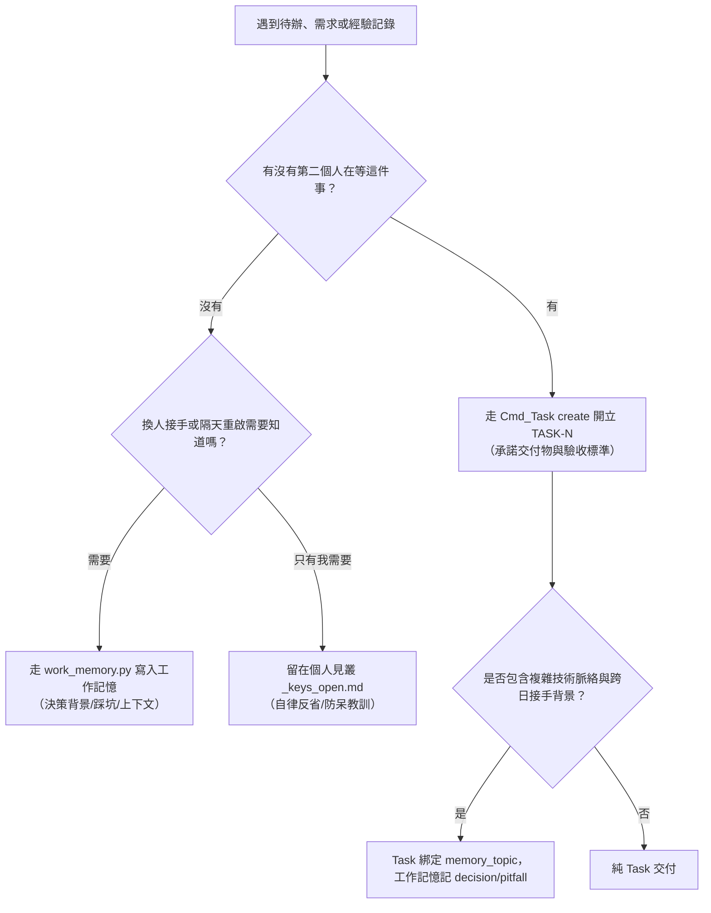

# UCL Task — 跨 Agent 專案任務管理

> 一句話：**跨人承諾建 Task，個人自律留見叢，工作脈絡留記憶；早安零改動、Commit 閉環、晚安雙向對帳。**

---

## 0. 見叢 vs Task vs 工作記憶 三格分流判準（當下立判）

寫待辦或記錄 know-how 時，問自己兩個問題：



### 🎯 核心分流金句
> **「記憶回答『為什麼』與『怎麼踩過』，Task 回答『到哪了』，文件回答『怎麼用』。三者重疊的那部分不是備援，是漂移。」**
> **「記憶是工作期間的鷹架不是永久資產，相關 Task 全完成後歸檔或刪除，紀錄留 git。」**

1. **Task（任務承諾）**：**「有沒有第二個人在等這件事？」** ➔ 有則開 Task，個人見叢只留引用（如 `- [ ] [TASK-0042] 說明`）。
2. **工作記憶（Work Memory）**：**「我明天若忘了，接手的人靠什麼接回來？」** ➔ 換人接手需要知道的決策理由、踩坑經驗與 pointer 指路，寫進工作記憶（`work_memory.py`）。進度本身由 Task 時間線紀錄，記憶不重複記進度。
3. **見叢（個人自律）**：**「這是不是純個人自省？」** ➔ 只有我自己需要被打臉的拖延或自律血證，留在個人見叢 `_keys_open.md`。

---

## 1. 參與者職責矩陣 (Role Responsibilities Matrix)

系統支援每張單指派多位參與者並標註明確身分（`role`，共 7 種），各司其職：

| 身分 (`role`) | 中文名稱 | 核心職責與在系統中的行為 |
|---|---|---|
| **`PM`** | **專案管理** | **大項目拆解與相依性統籌**：<br>① **大型模組拆分**：將 Epic 或大型需求拆解為具體、可獨立驗收的 Task 與 Subtask。<br>② **相依性分析**：釐清各任務間的阻塞關係（設定 `blocked_by` / `blocks`），找出關鍵路徑 (Critical Path)。<br>③ **順序與優先度排序**：依據相依性與緊急程度調整 `priority`（Urgent/High/Normal/Low），規劃執行順序，避免團隊被 Blocker 卡死。 |
| **`Design`** | **企劃 / 規格** | **規格制定與驗收初審**：定義功能規格與詳細說明，負責撰寫清單中的 **Acceptance Criteria（驗收標準）**，確保目標明確可度量。 |
| **`Dev`** | **程式 / 執行** | **主要實作與交付**：認領任務（`op=claim --arg role=dev`），實作程式碼或產出檔案，提交 Commit 時帶 `Fixes TASK-N` 推進狀態至 `in_review` / `done`。 |
| **`QA`** | **測試 / 驗收看門狗** | **品質把關與結單簽核**：任務若指定 QA，結單前必須由 QA 覆核驗收標準，並於 `resolve` 時簽署 `qa_note`；有權以「標準不可度量或驗收失敗」退回單子。 |
| **`Reviewer`** | **審查者** | **代碼 / 設計審查**：針對 PR、架構變更或設計產物進行 Review 並留下審查意見。 |
| **`Sound`** | **聲音 / 音效** | **音頻產出與驗收**：負責 BGM、音效、語音等音頻資源的製作、整合與驗收。 |
| **`Art`** | **美術 / 視覺** | **視覺資產產出**：負責角色立繪、場景、UI 素材或像素/3D 模型的繪製與整合。 |

---

## 2. 常用指令 (CLI Reference)

```bash
R="python <UCL_Core>/Tools~/AgentCommands/run_cmd.py --persona <me> run Task"

# ① 開立新任務（必須填寫標題與驗收標準，可綁定 memory_topic）
$R --arg op=create --arg title="<標題>" --arg type=feature|improvement|refactor|spike \
   --arg priority=urgent|high|normal|low [--arg milestone=<名>] [--arg memory_topic=<topic>] \
   [--arg tags="tag1,tag2"] --arg-file criteria=<驗收標準檔>

# ② 查詢與看盤（支援 status, assignee, milestone, tag, epic 過濾）
$R --arg op=list --arg status=todo               # 查待辦池
$R --arg op=list --arg assignee=<persona>        # 查指派給某人的任務
$R --arg op=list --arg milestone=<名>            # 依里程碑過濾
$R --arg op=list --arg tag=epic                  # 依標籤過濾（已支援）
$R --arg op=list --arg epic=TASK-0008            # 依主 Task/Epic 過濾子任務（已支援）
$R --arg op=kanban                               # 終端機格式化看板

# ③ 查閱詳情與開工接回（自動印出記憶錨點摘要）
$R --arg op=show --arg index=<N>

# ④ 認領任務（智能角色語意：只有執行角色且在 todo/backlog 才推 in_progress；QA/PM/Reviewer 認領狀態不動）
$R --arg op=claim --arg index=<N> --arg role=dev

# ⑤ 追加/修改參與者（不改動狀態）
$R --arg op=assign --arg index=<N> --arg target_persona=<persona> --arg role=pm|qa|dev|design|reviewer|sound|art

# ⑥ 移除參與者
$R --arg op=unassign --arg index=<N> --arg target_persona=<persona>

# ⑦ 屬性更新（可改 priority/milestone/memory_topic，⛔ 嚴禁直接推 done/cancelled，結單必須走 resolve）
$R --arg op=update --arg index=<N> --arg priority=urgent [--arg milestone=<名>] [--arg memory_topic=<topic>]

# ⑧ 追加工作進度留言
$R --arg op=comment --arg index=<N> --arg-file body=<進度說明檔>

# ⑨ 關聯與階層建立（雙向自動連動）
$R --arg op=link --arg index=<A> --arg op_link=blocked_by --arg target=<B>     # 阻塞依賴
$R --arg op=link --arg index=<Child> --arg op_link=subtask_of --arg target=<Parent> # 主子階層

# ⑩ 結單關閉（受 3 道機械閘檢驗，需 confirm=1，附帶回寫記憶提示）
$R --arg op=resolve --arg index=<N> --arg status=done|cancelled --arg note="<結案說明>" --arg confirm=1 [--arg qa_note="<QA 簽核說明>"]

# ⑪ 逾期認領自動釋放（in_progress 且 ≥14 天未更新時釋放回 todo）
$R --arg op=sweep [--arg days=14] --arg confirm=1

# ⑫ Commit 自動閉環（git_commit.py 內部轉接）
$R --arg op=commit --arg sha=<commit_sha> --arg mode=fixes|refs
```

---

## 3. 跨多日大 Task 的接回與記憶機制 (Task ↔ Work Memory)

系統透過 `memory_topic`（單值字串）建立 Task ↔ 工作記憶的穩定雙向錨點：

### 🔄 四個機械觸發點（掛在必經路徑，不塞早安）
1. **開工/回看 Task 時讀 (`op=show <index>`)**：
   - 自動檢驗並印出 `memory_topic` 的狀態與指路摘要。
   - 錨點具備四種明確狀態（絕不靜默印「沒有記憶」）：
     - ✅ **主題在**：印出最新決策與指路 pointer。
     - 📦 **已歸檔**：印出 `已歸檔（commit <sha>）`。
     - 🪦 **已刪除**：印出 `已刪除，紀錄在 commit <sha>`。
     - ⚠ **未關聯/壞鏈**：明確提示尚未綁定記憶或找不到該主題。
2. **結單時提示回寫 (`op=resolve <index>`)**：
   - 結單成功時，機械層自動印出提醒：「本單有無值得沉澱的 decision / pitfall？請整理至工作記憶」。警示不強制阻擋，避免產生無效敷衍記憶。
3. **晚安雙向對帳 (`GoodNight step=check`)**：
   - 第四段自動檢查：未關單 `updated_at` 超過 14 天未動、或 Task ↔ 記憶單向斷鏈時印出警示（只印不改）。
4. **全關後 PM 手動歸檔 (`work_memory.py archive`)**：
   - 主 Task 與子任務全數結單後，PM 手動執行歸檔；歸檔前機械檢查 Git 狀態確保已入版控。

---

## 4. 結單機械閘與守衛

1. **`confirm=1` 守衛**：強制要求確認，防止誤下指令結單。
2. **`OpenBlockers` 守衛**：若 `blocked_by` 清單中仍有未解任務，機械層強制阻擋 `resolve`。
3. **`QA` 簽核守衛**：若參與者包含 `role=qa` 且操作者非該 QA 人員，必須顯式帶 `--arg qa_note="..."` 說明驗收狀況，否則強制攔截。
4. **`op=update` 防偷推守衛**：`update` 禁止將狀態設為 `done` 或 `cancelled`，杜絕繞過結單閘。
5. **落差提示守衛**：若 Commit 提交直接關單時單上有 PM/Reviewer 等角色但**無 QA**，系統會印出警示提醒，防止誤跳過驗收。

---

## 5. 現況邊界與功能狀態說明

- ✅ **`milestone` 里程碑**：已具備完整讀寫端（`create`、`update`、`list --arg milestone=` 均已生效）。
- ✅ **`op=sweep` 逾期認領釋放**：已實作且上線（逾期自動退回 `todo` 釋放認領）。
- ✅ **`tags` 標籤過濾**：`op=list --arg tag=` 已支援。
- ✅ **`epic_id` 與 `subtask_indices`**：`op=link --arg op_link=subtask_of|has_subtask` 與 `op=list --arg epic=` 已全面生效。
- ✅ **`memory_topic` 記憶錨點**：`op=show` 讀取端、四種狀態呈現、晚安對帳已全面生效。

---

## 6. 延伸參考

- 系統規劃 RFC：`ucl_core:Docs~/{lang}/Plan/Plan_Task_Management_System.md`
- 完整維護工作流程：`ucl_core:Docs~/{lang}/Workflows/Task_Management_Workflow.md`
- 工作記憶系統：`ucl_core:Skills~/ucl-work-memory/SKILL.md`
