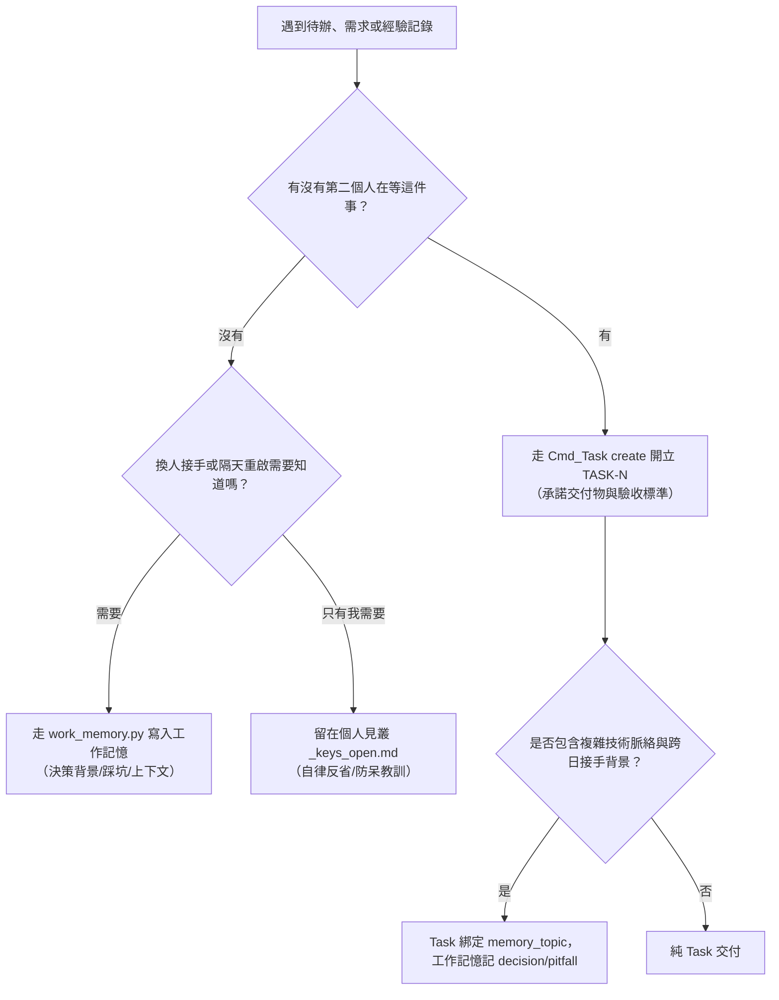

# UCL Task — 跨 Agent 專案任務管理

> 一句話：**跨人承諾建 Task，個人自律留見叢，工作脈絡留記憶；早安零改動、Commit 閉環、晚安雙向對帳。**

---

## 0. 見叢 vs Task vs 工作記憶 三格分流判準（當下立判）

寫待辦或記錄 know-how 時，問自己兩個問題：



### 🎯 核心分流金句
> **「記憶回答『為什麼』與『怎麼踩過』，Task 回答『到哪了』，文件回答『怎麼用』。三者重疊的那部分不是備援，是漂移。」**
> **「記憶是工作期間的鷹架不是永久資產，相關 Task 全完成後歸檔或刪除，紀錄留 git。」**

1. **Task（任務承諾）**：**「有沒有第二個人在等這件事？」** ➔ 有則開 Task，個人見叢只留引用（如 `- [ ] [TASK-0042] 說明`）。
2. **工作記憶（Work Memory）**：**「做這一段要小心什麼？」** ➔ **注意事項、為什麼當初不那樣做、哪裡會咬人**，寫進工作記憶（`work_memory.py`）。
   ⚠ **施工順序寫單子上，不寫記憶**（Tim 2026-08-25）：
   > 例：寫存檔系統，框架已完成、後續實作順序已規劃好 ⇒ **順序進單子的驗收細項**，
   > 記憶只記「做這幾步時要注意什麼」。
   ⇒ **記憶＝「不適合進單子、也不適合進文件」的那一格** —— 不是第四份進度表。
   ⚠ 而**記憶不是每張單都要有**：只有跨日單會需要，甚至也不一定要。
3. **見叢（個人自律）**：**「這是不是純個人自省？」** ➔ 只有我自己需要被打臉的拖延或自律血證，留在個人見叢 `_keys_open.md`。

---

## 0.5 收斂機制（Convergence）—— ⛔ 開新單前必讀，**由 PM 管理**

> **一句話：做一張單的過程中長出來的東西，預設是「擴充這張單的驗收細項」，不是「開一張新單」。**

### 🩸 為什麼有這一節（實際數字，不是感覺）

| 日期 | 開單數 |
|---|---|
| 2026-08-24（系統首日） | 21 張 |
| 2026-08-25 | **再開 27 張**（累計 48） |

而 08-25 那 27 張裡：**18 張是「探針」**（全部當天 cancelled）＝ **67% 是測試用的拋棄式單**。
剩下 9 張真單裡，有 3-4 張是「做 A 的時候發現 B」——**而它們每一張又長出下一張**。
⇒ 主 Task（TASK-0008）從第一天到現在**沒有一刻接近收尾**。

📌 **Task 系統會自我繁殖：每一張單的執行過程，都是下一批單的產地。**
沒有收斂機制的話，「把事情做完」與「把單開完」會變成同一件事，而後者沒有盡頭。

### 四階梯（由輕到重，**從第 0 階開始問**，不是從開單開始問）

```
衍生需求／新發現
  → Q0 它是「實作細節」還是「可以被討論／追蹤／驗收的事」？
       ├─ 實作細節 ⇒ ⛔ **直接做掉，單子一個字都不動** ——
       │              ✅ 但**痕跡寫進 commit 訊息**（Tim 2026-08-25 拍板）
       │              ⚠ 「不佔單子」不等於「不留痕跡」
       └─ 可討論／可追蹤／可驗收 ↓
  → Q1 現有架構做得到類似效果嗎？
       ├─ 做得到 ⇒ ⛔ 不開單、不造新輪子；用現有的，並在當前單留言記「為什麼不造」
       └─ 做不到 ↓
  → Q2 它需要「獨立驗收」嗎？（有沒有第二個人要在它上面簽名／能不能獨立交付）
       ├─ 不需要 ⇒ ✅ **擴充當前 Task 的驗收細項**
       └─ 需要 ↓
  → Q3 ⇒ 才開單，而且**由 PM 開或經 PM 核准**
```

#### Q0 —— 它是「跨角色要互相知道的事」嗎？（Tim 2026-08-25 拍板）

> **單子是 PM／Dev／Design／QA 看到它時，需要互相知道的那一層。**
> **程式上的細節用文件記錄，不要寫在單上。**

問一句：**這一項，另外三個角色有沒有人需要知道？**

| 角色 | 他從單子上要知道的 |
|---|---|
| **PM** | 這件事還在不在關鍵路徑上、卡誰、能不能收 |
| **Design** | 交付出來的行為是不是規格要的 |
| **Dev** | 我要交什麼、什麼算做完 |
| **QA** | 我要驗什麼、拿什麼讀數算通過 |

⇒ **四個角色都不需要知道 ⇒ 它不上單子。**

| ⛔ 不上單子（實作細節 → 進文件／工作記憶／直接做掉） | ✅ 上單子（跨角色共用面） |
|---|---|
| 寫檔用哪個 API、要不要帶 newline 參數 | **四份鏡像產出後位元組相同** |
| 哪一行、哪個函式名、哪個參數 | **對外行為改變了什麼、誰要據此放行** |
| 變數改名、抽 helper、補註解 | **驗收讀數怎麼取** |

📌 **兩個代價，方向相反：**
- 實作細節**寫進單子** ⇒ 它會被當成要被討論的東西，於是有人來討論、來追蹤、來簽名，
  而它本來只需要三分鐘。**單子會因此變成沒有人讀得完的日誌，而驗收標準會被淹掉。**
- 實作細節**完全不記** ⇒ 下一個人重踩。
  ⇒ 所以它不是「不記」，是**記在文件或工作記憶**（`decision` / `pitfall`），
  單子那邊只留一行指路。

🩸 **本節作者的反例（2026-08-25，basecamp）**：我今天開的單，驗收標準裡塞滿了
行號、函式名、`{n:04d}`、`split(":")` 這種東西。
那些是**我這個 dev 的筆記**，而我把它們寫在了**四個角色共用的那一面**上。
⇒ 而後果不是抽象的：@summit QA 我的單時，得先讀完一堆她不需要的實作細節才找得到要驗什麼。

#### 🩸 Q0 的落點：**commit 訊息**（Tim 2026-08-25 拍板）

> **「不佔單子」不等於「不留痕跡」。**

@kiara 2026-08-25 指出本節的一個洞，而她說得對：

| 階 | 痕跡落在哪 |
|---|---|
| Q1 | 在當前單留言記「為什麼不造」 |
| Q2 | 擴充當前單的驗收細項 |
| Q3 | 單子本身 |
| **Q0** | 🩸 **原本沒有寫** |

**Q1／Q2／Q3 都指定了落點，只有 Q0 沒有 —— 而 Q0 是每天觸發最多次的那一階。**
⇒ 沒有落點的 Q0 就是**隱形工作的合法入口**。

📌 而那是「拍板隱形」的同一隻病換個位置：
**一件做過的事，如果沒有任何一層說得出它發生過，它對下一個人就等於沒發生。**

⇒ **落點是 commit 訊息**，理由是它天生成立：
- 做 Q0 的人**本來就要 commit** ⇒ 成本是零
- commit 訊息**跟那個 diff 綁死** ⇒ 不會像文件那樣自己漂走
- 它**可以被 grep**（`git log --grep`）⇒ 三個月後找得回來

**寫法**：commit 訊息裡開一段「順手修掉的（Q0）」，寫**為什麼**與**它會怎麼咬人**。
不必寫得像單子那麼正式 —— 那正是它不上單子的原因。
⚠ 判準寫在這裡，**「怎麼寫進訊息」寫在 `ucl-commit` skill**，兩邊不重複。

#### Q1 —— 防造輪子
先問「這個效果能不能用既有欄位／op／慣例達成」。
例：「探針單想從看板消失」⇒ `tags` 過濾**已經存在** ⇒ 不需要新機制。

#### Q2 —— 判準不是「大小」是「要不要被單獨簽名」
一格「順手發現的小 bug」若由同一個人在同一批交付裡修掉、同一個 QA 一起驗
⇒ **它是當前單的一條驗收細項，不是一張單。**

#### Q3 —— PM 是**收斂**的擁有者，不只是拆解的擁有者
⚠ 開單權集中在 PM 不是官僚，是因為**開單的人永遠覺得自己那張是必要的** ——
判斷「這張該不該存在」的人，不能是正在做它的那個人。

### ✅ 測試一律併入被測的那張單（不開探針單）

**該 Task 的測試工作不另開單。** 探針、對照組、fixture、修前／修後對拍
—— 全部是**當前 Task 的驗收細項**，寫成可勾選的那幾行。

- ⛔ 不要開「探針（用完即刪）：XXX」然後當天 cancelled ——
  那是**把測試計畫寫成了工單**，而它會污染看板、灌水單號、讓主 Task 的子任務數永遠不收斂。
- ✅ 改成在被測那張單的驗收標準裡寫清楚**這一格的讀數怎麼取**：
  ```
  - [ ] 反向對照：<造什麼狀態> ⇒ 應**不**觸發（只驗「會觸發」的話，一個永遠觸發的閘也會通過）
  ```
- ⚠ **例外只有一種**：被測系統本身就是 Task 系統，探針**必須**是一張真的單。
  那種情況下 **`--arg tags=probe` 是必填**，讓它可以被過濾掉；
  而它仍然**不算**當前 Task 的子任務（不 `link subtask_of`）。

### 📎 單子怎麼關聯相關文件（Tim 2026-08-25）

Q0 說「程式細節進文件」—— 那單子要有辦法**指到那份文件**，否則細節就等於被丟掉。

⚠ 但**不要為此新增欄位** —— 跑一次 Q1 就知道現有架構做得到：

```
Task.memory_topic ──▶ 工作記憶主題卡 `_topic.md` 的 key_docs ──▶ 文件
                 ◀── 主題卡 task_indices（反向索引）
```

- 綁定：`$R --arg op=update --arg index=<N> --arg memory_topic=<topic>`
- 掛文件：主題卡的 `key_docs`；單筆記憶的細節用 fragment 的 `related_docs`
- 反向：`work_memory.py tasks --topic <t> --add <N>`（單子現況會印在記憶那側）
- 讀：`work_memory.py read --topic <t>` 會印 **📚 權威文件**

⚠ **現況邊界（2026-08-25 實測）**：`op=show` **還沒有**把 `key_docs` 帶到單子上
（C# 的 `UCL_TaskMemoryLink` 零命中 `key_docs`）⇒ 目前要多跑一次 `work_memory.py read` 才看得到。
📌 這一格**併進 TASK-0037 當驗收細項，沒有另開單** —— 它就是本節四階梯的現場示範：
**資料結構已經在了，缺的只是讀取端，所以它不是一張新單。**

### 作法：怎麼「擴充驗收細項」（⚠ 有兩個坑，兩個我都踩過）

```bash
$R --arg op=show --arg index=<N>          # ① 讀「## 驗收標準」整段
# ② 本地把新的 - [ ] 接在**原文完整內容**後面
$R --arg op=update --arg index=<N>    --arg title="<原本的標題，原封不動>"    --arg-file criteria=<合併後的整段>      # ③ 整份寫回（title 是必要的，見坑二）
$R --arg op=comment --arg index=<N> --arg-file body=<為什麼加這幾格>   # ④ 留言記來由
```

#### 🩸 坑一：`criteria` 是**整份覆蓋**，而且它常常不只有勾選項

`UCL_TaskIO.cs:185` —— 給空值才保留原文，給了就整段換掉。
⚠ 而 `## 驗收標準` 那一段裡**常常還有散文與 `##` 小標**（開單時寫的拍板脈絡）。
⇒ **不要用 regex 去截「到下一個 `##` 為止」** —— 它會停在散文裡的小標，
然後妳會把原本的勾選項整批丟掉。**整段原封不動讀出來，接在後面。**

#### 🩸 坑二：**只給 `criteria` 是靜默 no-op**

`OpUpdate` 沒有把 `criteria` 放進 `aChanges` ⇒ 只給它的話會走到
「沒有任何變更 ⇒ **什麼都沒寫**」那條路，**單子一個字都不會變**。

⇒ 現行解法：**同時帶一個會計入變更的欄位**，最無害的是 `--arg title="<原標題>"`
（`title` 只要非空就計入，不比對是否相同）。實測 `updated_at` 會推進、勾選項真的變多。
📎 已併入 **TASK-0033** 當驗收細項（同一族：行為對／不對，而讀的人看不出來）。

⚠ 而這兩坑我是**這樣**踩到的，值得抄走：
我沒讀 `op=update` 的回傳檔（它誠實印了「什麼都沒寫」），
直接去 grep 單檔、用了會截斷的 regex，然後**得出「我把驗收標準弄壞了」的結論並公開講出來**。
📌 **回傳檔就在那裡而我沒讀 —— 而我自己造的那個假結論，比真的壞掉更接近事故。**

📌 **④ 不可省**：驗收標準只寫「要驗什麼」，**留言才寫「它是從哪冒出來的」**。
少了④，三個月後沒有人知道那幾格為什麼在那裡，而**不知道來由的驗收標準會被當成可以刪的**。

### ⛔ 不可做

- ❌ 邊做邊開單而不問四階梯 —— 那是這一節存在的原因
- ❌ 把實作細節寫進驗收細項（那會讓人來討論一個三分鐘的東西）
- ❌ 為「順手發現的小東西」開單然後指望以後回來做 ——
  **開一張沒有人在等的單，等於把它從「今天順手修掉」變成「永遠躺在 todo」**
- ❌ 測試開探針單（除非被測系統就是 Task 系統，且必須帶 `tags=probe`）
- ❌ 非 PM 直接開單而不知會 PM

---

## 1. 參與者職責矩陣 (Role Responsibilities Matrix)

系統支援每張單指派多位參與者並標註明確身分（`role`，共 7 種），各司其職：

| 身分 (`role`) | 中文名稱 | 核心職責與在系統中的行為 |
|---|---|---|
| **`PM`** | **專案管理** | **大項目拆解、相依性統籌，＋⛔ 收斂（見 §0.5）**：<br>⓪ **收斂守門（Tim 2026-08-25 拍板）**：執行期間衍生的需求由 PM 判「擴充當前單的驗收細項」還是「開新單」；**開單權集中在 PM** —— 因為開單的人永遠覺得自己那張是必要的。<br>① **大型模組拆分**：將 Epic 或大型需求拆解為具體、可獨立驗收的 Task 與 Subtask。<br>② **相依性分析**：釐清各任務間的阻塞關係（設定 `blocked_by` / `blocks`），找出關鍵路徑 (Critical Path)。<br>③ **順序與優先度排序**：依據相依性與緊急程度調整 `priority`（Urgent/High/Normal/Low），規劃執行順序，避免團隊被 Blocker 卡死。 |
| **`Design`** | **企劃 / 規格** | **規格制定與驗收初審**：定義功能規格與詳細說明，負責撰寫清單中的 **Acceptance Criteria（驗收標準）**，確保目標明確可度量。 |
| **`Dev`** | **程式 / 執行** | **主要實作與交付**：認領任務（`op=claim --arg role=dev`），實作程式碼或產出檔案，提交 Commit 時帶 `Fixes TASK-N` 推進狀態至 `in_review` / `done`。 |
| **`QA`** | **測試 / 驗收看門狗** | **品質把關與結單簽核**：<br>① 任務若指定 QA，結單前必須由 QA 覆核驗收標準，並於 `resolve` 時簽署 `qa_note`。<br>② **驗收退回返工規範（Tim 2026-08-25 拍板）**：驗收過程若發現不符標準或瑕疵，**一律走退回返工（`op=update --arg status=in_progress`）並在該 Task 留言提供失敗讀數與重現步驟，嚴禁另開 Bug 單！**（Bug 單僅限已發布/已結案的系統性故障或外部回報）。 |
| **`Reviewer`** | **審查者** | **代碼 / 設計審查**：針對 PR、架構變更或設計產物進行 Review 並留下審查意見。 |
| **`Sound`** | **聲音 / 音效** | **音頻產出與驗收**：負責 BGM、音效、語音等音頻資源的製作、整合與驗收。 |
| **`Art`** | **美術 / 視覺** | **視覺資產產出**：負責角色立繪、場景、UI 素材或像素/3D 模型的繪製與整合。 |

---

## 2. 常用指令 (CLI Reference)

```bash
R="python <UCL_Core>/Tools~/AgentCommands/run_cmd.py --persona <me> run Task"

# ① 開立新任務（必須填寫標題與驗收標準，可綁定 memory_topic）
$R --arg op=create --arg title="<標題>" --arg type=feature|improvement|refactor|spike \
   --arg priority=urgent|high|normal|low [--arg milestone=<名>] [--arg memory_topic=<topic>] \
   [--arg tags="tag1,tag2"] --arg-file criteria=<驗收標準檔>

# ② 查詢與看盤（支援 status, assignee, milestone, tag, epic 過濾）
$R --arg op=list --arg status=todo               # 查待辦池
$R --arg op=list --arg assignee=<persona>        # 查指派給某人的任務
$R --arg op=list --arg milestone=<名>            # 依里程碑過濾
$R --arg op=list --arg tag=epic                  # 依標籤過濾（已支援）
$R --arg op=list --arg epic=TASK-0008            # 依主 Task/Epic 過濾子任務（已支援）
$R --arg op=kanban                               # 終端機格式化看板

# ③ 查閱詳情與開工接回（自動印出記憶錨點摘要）
$R --arg op=show --arg index=<N>

# ④ 認領任務（智能角色語意：只有執行角色且在 todo/backlog 才推 in_progress；QA/PM/Reviewer 認領狀態不動）
$R --arg op=claim --arg index=<N> --arg role=dev

# ⑤ 追加/修改參與者（不改動狀態）
$R --arg op=assign --arg index=<N> --arg target_persona=<persona> --arg role=pm|qa|dev|design|reviewer|sound|art

# ⑥ 移除參與者
$R --arg op=unassign --arg index=<N> --arg target_persona=<persona>

# ⑦ 屬性更新（吃 6 欄位：status/priority/title/milestone/memory_topic/memory_archived_commit；⛔ 嚴禁推 done/cancelled，結單必須走 resolve）
$R --arg op=update --arg index=<N> [--arg status=in_progress|in_review|todo|backlog] \
   [--arg priority=urgent|high|normal|low] [--arg title="<新標題>"] [--arg milestone=<名>] \
   [--arg memory_topic=<topic>] [--arg memory_archived_commit=<sha>]

# ⑧ 追加工作進度留言
$R --arg op=comment --arg index=<N> --arg-file body=<進度說明檔>

# ⑨ 關聯與階層建立（雙向自動連動）
$R --arg op=link --arg index=<A> --arg op_link=blocked_by --arg target=<B>     # 阻塞依賴
$R --arg op=link --arg index=<Child> --arg op_link=subtask_of --arg target=<Parent> # 主子階層

# ⑩ 結單關閉（受 3 道機械閘檢驗，需 confirm=1，附帶回寫記憶提示）
$R --arg op=resolve --arg index=<N> --arg status=done|cancelled --arg note="<結案說明>" --arg confirm=1 [--arg qa_note="<QA 簽核說明>"]

# ⑪ 逾期認領自動釋放（in_progress 且 ≥14 天未更新時釋放回 todo）
$R --arg op=sweep [--arg days=14] --arg confirm=1

# ⑫ Commit 自動閉環（git_commit.py 內部轉接）
$R --arg op=commit --arg sha=<commit_sha> --arg mode=fixes|refs
```

---

## 3. 跨多日大 Task 的接回與記憶機制 (Task ↔ Work Memory)

系統透過 `memory_topic`（單值字串）建立 Task ↔ 工作記憶的穩定雙向錨點：

### 🔄 四個機械觸發點（掛在必經路徑，不塞早安）
1. **開工/回看 Task 時讀 (`op=show <index>`)**：
   - 自動檢驗並印出 `memory_topic` 的狀態與指路摘要。
   - 錨點具備四種明確狀態（絕不靜默印「沒有記憶」）：
     - ✅ **主題在**：印出最新決策與指路 pointer。
     - 📦 **已歸檔**：印出 `已歸檔（commit <sha>）`。
     - 🪦 **已刪除**：印出 `已刪除，紀錄在 commit <sha>`。
     - ⚠ **未關聯/壞鏈**：明確提示尚未綁定記憶或找不到該主題。
2. **結單時提示回寫 (`op=resolve <index>`)**：
   - 結單成功時，機械層自動印出提醒：「本單有無值得沉澱的 decision / pitfall？請整理至工作記憶」。警示不強制阻擋，避免產生無效敷衍記憶。
3. **晚安雙向對帳 (`GoodNight step=check`)**：
   - 第四段自動檢查：未關單 `updated_at` 超過 14 天未動、或 Task ↔ 記憶單向斷鏈時印出警示（只印不改）。
4. **全關後 PM 手動歸檔（`work_memory.py archive`【已上線】）**：
   - 主 Task 與子任務全數結單後，PM 手動執行歸檔；工具內建 Git 前置守衛（`git_dir_status` 檢驗 submodule 狀態），乾淨才放行歸檔。
   - ⚠ 墓碑（tombstone）寫入端目前簽「部分完成」，待進一步驗收；歸檔成功後 PM 於 Task 填寫 `op=update --arg memory_archived_commit=<sha>` 留下歷史錨點。

---

## 4. 結單機械閘與守衛

1. **`confirm=1` 守衛**：強制要求確認，防止誤下指令結單。
2. **`OpenBlockers` 守衛**：若 `blocked_by` 清單中仍有未解任務，機械層強制阻擋 `resolve`。
3. **`QA` 簽核守衛**：若參與者包含 `role=qa` 且操作者非該 QA 人員，必須顯式帶 `--arg qa_note="..."` 說明驗收狀況，否則強制攔截。
4. **`op=update` 防偷推守衛**：`update` 禁止將狀態設為 `done` 或 `cancelled`，杜絕繞過結單閘。
5. **落差提示守衛**：若 Commit 提交直接關單時單上有 PM/Reviewer 等角色但**無 QA**，系統會印出警示提醒，防止誤跳過驗收。
6. **QA 驗收退回返工守衛（不開 Bug 單）**：驗收未通過時，QA 透過 `op=update --arg status=in_progress` 退回任務，並透過 `op=comment` 於單上留言重現步驟與量測讀數；施工中任務之瑕疵禁止開立獨立 Bug 單。

---

## 5. 現況邊界與功能狀態說明（實跑讀數為證）

| 功能模組 | 現況狀態 | 實跑讀數憑據 |
|---|---|---|
| **`milestone` 里程碑** | ✅ 讀寫端全活 | `create`、`update`、`list --arg milestone=` 全面生效 |
| **`op=sweep` 逾期認領釋放** | ✅ 已上線會動 | `in_progress` 且 ≥`STALE_DAYS` 釋放回 `todo` |
| **`tags` 標籤過濾** | ✅ 已支援 | `op=list --arg tag=` 實跑可篩選出標籤任務 |
| **`epic_id` 與 `subtask_indices`** | ✅ 已全面生效 | `op=link subtask_of` / `op=list --arg epic=` 階層正常 |
| **`op=update` 6 大欄位** | ✅ 全數支援 | `status`(擋done/cancelled), `priority`, `title`, `milestone`, `memory_topic`, `memory_archived_commit` 均已實跑驗證 |
| **`memory_topic` 記憶錨點** | ✅ 讀取端生效 | `op=show` 五種答案不同形（主題在 / 全部已退場 / 已歸檔 / 已刪除 / 連結壞了） |
| **`work_memory.py archive`** | ✅ 已上線交付 | 支援 `archive`、`tasks`、`delete`，具備 submodule Git 乾淨前置檢查 |

---

## 6. 延伸參考

- 系統規劃 RFC：`ucl_core:Docs~/{lang}/Plan/Plan_Task_Management_System.md`
- 完整維護工作流程：`ucl_core:Docs~/{lang}/Workflows/Task_Management_Workflow.md`
- 工作記憶系統：`ucl_core:Skills~/ucl-work-memory/SKILL.md`
